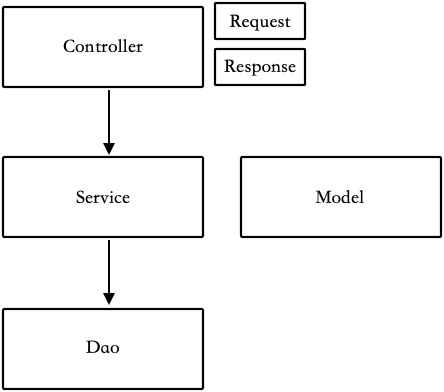
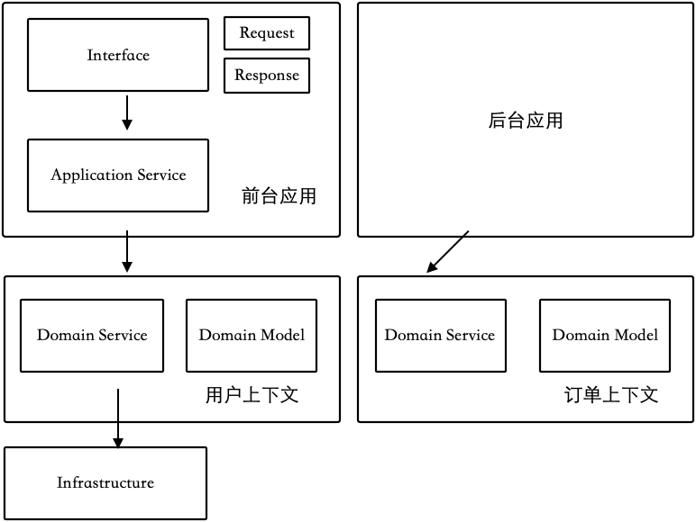
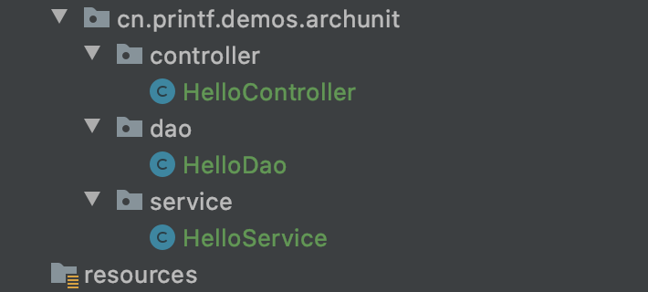
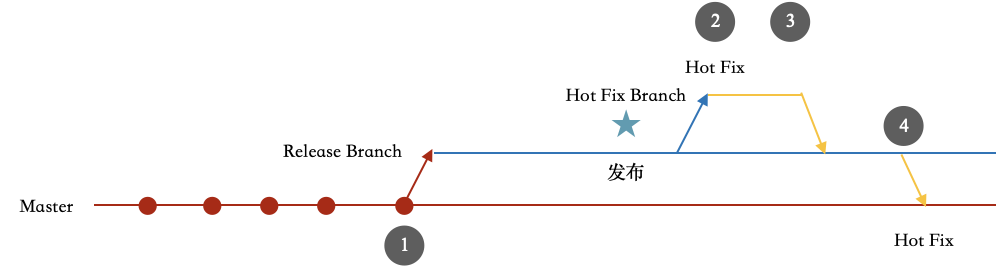

第 2 章 代码评审
================

在软件开发过程中，除了可以从功能角度发现问题以外，还可以通过代码检视发现一些显而易见的问题，做好这部分工作带来的收益甚至比测试人员手动测试还高。

在实践中，对代码进行评审可以从如下三个层面把控：

-   静态代码分析。

-   每日代码评审。

-   代码合入请求。

**静态代码分析**是指在代码提交时使用工具自动扫描，或者在流水线中让构建服务器代为扫描。一般来说，大的公司会有专门的部门采购各种代码分析工具，我们可以从代码风格、潜在的缺陷、合规和安全等方面系统地检查代码中存在的问题。扫描不合格的代码不予发布，避免为产品带来潜在的风险。

**每日代码评审**是指团队每日一起评审当日或上一日的代码，一般在下午下班前进行，时间需要控制在30～60分钟。每日代码评审除了可以用于提高代码质量以外，也可以用于团队的技术交流和问题沟通，毕竟大家工作在同一个代码仓库里。

代码评审一般由人工完成，可使用Git、GitLab、IntelliJ IDEA等工具。代码评审作为静态代码分析的补充方法，一般不会涉及已经被静态代码分析所覆盖的内容。

**代码合入请求**是指在必要时通过合入请求来合入代码。具体合入方式取决于团队使用的Git工作流，一般敏捷团队会使用主干开发的方式。在一个新的迭代开启后，团队会在主干上开发、提交代码，并且会在需要发布的时候创建一个Release分支来冻结代码。代码冻结后，如果还有缺陷需要修复，为了保证测试的可靠性，避免多次全量回归，就需要通过合入请求来合入。

上述每一个层面都有不同的价值，它们不仅可以合理管理代码质量，还能做到不打扰开发人员的日常工作，不增加额外的负担。

本章将围绕这三个层面展开，目标是基于对代码的静态代码分析、人工检查等方法来提高代码质量，涵盖的内容如下：

-   静态代码分析。

-   人工代码评审的方法和实践。

-   Git工作流。

2.1 常用的静态代码分析工具
--------------------------

一些大的公司都会进行静态代码分析，他们一般会通过一些定制化的工具或者平台来完成此项工作。对于中小团队来说，可以选用下面几种开源的静态代码分析工具。

-   Checkstyle，可以用于检查代码风格，例如代码的缩进、每行的最大长度、换行等规范问题。

-   ArchUnit，可以用于检查代码的分层关系，避免不合理的代码依赖关系出现，比如循环引用等。

-   FindBugs，可以用于检查潜在的缺陷，例如打开的文件没有关闭、潜在的内存泄漏等。

-   OWASP Dependency-Check，可以用于检查引入的第三方代码包是否有公开的漏洞等。

这些工具基本都有IDE插件，相关插件的使用比较简单，不需要过多介绍，如果希望将其集成到构建过程中，则需要使用相应的配置。海外的Java项目一般使用Gradle（一种构建工具，与Maven类似），国内的
Java项目则使用Maven较多。

下面以使用Maven为例，介绍一下如何配置这几种静态代码分析工具，并给出各个配置项的含义。本章的代码示例都是Maven多模块实现的，这里也推荐使用IntelliJ IDEA作为开发工具， 它是业界公认的优秀 Java 开发工具。

本节的示例代码可以在Git仓库 [https://github.com/java-self-testing/java-self-testing-example](ps://github.com/java-self-testing/)
中下载。

### 2.1.1 Checkstyle

Checkstyle是一款Java静态代码分析工具，可帮助程序员编写符合编码规范的Java代码。它会自动完成检查，能让程序员避免手工做这些琐碎的事情。

Checkstyle自带了Sun公司和谷歌公司的Java代码风格配置文件，我们可基于此定义适合自己团队的代码规范。可以通过IDEA插件、Maven、Gradle等不同的工具和平台来运行Checkstyle，如果有错误提示，Checkstyle
会中断构建并提供友好的报告。

#### 1. 在 Maven 中使用 Checkstyle

创建一个Maven模块，在Pom文件中添加如代码清单2-1所示的配置。

代码清单2-1 Checkstyle中的Pom配置
```java
<properties>
    <project.build.sourceEncoding>UTF-8</project.build.sourceEncoding>
</properties>

<build>
    <plugins>
        <plugin>
            <groupId>org.apache.maven.plugins</groupId>
            <artifactId>maven-checkstyle-plugin</artifactId>
            <version>3.1.2</version>
            <dependencies>
                <!--  Checkstyle plugin 使用的 Checkstyle 库，可以自定义版本  -->
                <dependency>
                    <groupId>com.puppycrawl.tools</groupId>
                    <artifactId>checkstyle</artifactId>
                    <version>8.40</version>
                </dependency>
            </dependencies>
            <executions>
                <!--  加入到 maven 的构建生命周期中去  -->
                <execution>
                    <id>checkstyle</id>
                    <phase>validate</phase>
                    <goals>
                        <goal>check</goal>
                    </goals>
                    <configuration>
                        <failOnViolation>true</failOnViolation>
                    </configuration>
                </execution>
            </executions>
        </plugin>
    </plugins>
</build>
```

配置完成后，可以直接使用 Maven 命令检查代码风格：

```
mvn checkstyle:check
```

#### 2. 自定义代码风格检查规则

Checkstyle默认的风格可能会与我们日常开发的习惯不相符，直接使用有可能会导致在日常的开发过程中IDE格式化的结果和Checkstyle冲突、默认的参数过于苛刻等问题。虽然可以将Checkstyle的配置文件导入IDE格式化器的相关配置中，但如果有新同事加入，则又需要额外配置。所以，我们一般都会对 Checkstyle 默认的配置文件做一些修改，将其调整为适合自己团队的工作方式，尽量按照IDE的默认格式化风格来操作。

在Maven的Pom文件中通过checkstyle.config.location属性可以配置一个XML文件来定制Checkstyle规则，具体参考如下代码：

```
<properties>
    <project.build.sourceEncoding>UTF-8</project.build.sourceEncoding>
    <!--   自定义的配置文件，相对于 Pom 文件的路径     -->
    <checkstyle.config.location>checkstyle/checkstyle.xml</checkstyle.config.location>
</properties>
```

我们在实际项目中通常都需要定制上述规则，代码清单2-2基于Google Java 代码规则对配置做了调整，并给出了具体说明。

代码清单2-2 自定义 Checkstyle 规则的配置文件

```
<?xml version="1.0"?>
<!DOCTYPE module PUBLIC
        "-//Checkstyle//DTD Checkstyle Configuration 1.3//EN"
        "https://checkstyle.org/dtds/configuration_1_3.dtd">
<module name = "Checker">
    <property name="charset" value="UTF-8"/>

    <!--违规级别，用于提示给构建工具，如果是 error 级别会让构建失败-->
    <property name="severity" value="warning"/>

    <!--扫描的文件类型-->
    <property name="fileExtensions" value="java, properties, xml"/>
    <!-- Excludes all 'module-info.java' files              -->
    <!-- See https://checkstyle.org/config_filefilters.html -->
    <!-- 排除 'module-info.java' 模块描述文件 -->
    <module name="BeforeExecutionExclusionFileFilter">
        <property name="fileNamePattern" value="module\-info\.java$"/>
    </module>
    <!-- https://checkstyle.org/config_filters.html#SuppressionFilter -->
    <!--定义忽略规则文件位置-->
    <module name="SuppressionFilter">
        <property name="file" value="${org.checkstyle.google.suppressionfilter.config}"
                  default="checkstyle-suppressions.xml" />
        <property name="optional" value="true"/>
    </module>

    <!-- Checks for whitespace                               -->
    <!-- See http://checkstyle.org/config_whitespace.html -->
    <!--检查文件空白制表字符-->
    <module name="FileTabCharacter">
        <property name="eachLine" value="true"/>
    </module>

    <!--检查单行长度，原规则是 100，但是往往不够用，所以会设置长一点-->
    <module name="LineLength">
        <property name="fileExtensions" value="java"/>
        <property name="max" value="160"/>
        <property name="ignorePattern" value="^package.*|^import.*|a href|href|http://|https://|ftp://"/>
    </module>

    <!--检查 Java 源代码语法树-->
    <module name="TreeWalker">
        <!--检查类型和文件名是否匹配，类名和文件名需要对应-->
        <module name="OuterTypeFilename"/>
        <!--检查不合规的文本，考虑使用特殊转义序列来代替八进制值或 Unicode 值。-->
        <module name="IllegalTokenText">
            <property name="tokens" value="STRING_LITERAL, CHAR_LITERAL"/>
            <property name="format"
                      value="\\u00(09|0(a|A)|0(c|C)|0(d|D)|22|27|5(C|c))|\\(0(10|11|12|14|15|42|47)|134)"/>
            <property name="message"
                      value="Consider using special escape sequence instead of octal value or Unicode escaped value."/>
        </module>
        <!--避免使用 Unicode 转义-->
        <module name="AvoidEscapedUnicodeCharacters">
            <property name="allowEscapesForControlCharacters" value="true"/>
            <property name="allowByTailComment" value="true"/>
            <property name="allowNonPrintableEscapes" value="true"/>
        </module>
        <!--避免在 import 语句中使用 * -->
        <module name="AvoidStarImport"/>
        <!--每个文件中只允许有一个顶级类-->
        <module name="OneTopLevelClass"/>
        <!--该类语句不允许换行-->
        <module name="NoLineWrap">
            <property name="tokens" value="PACKAGE_DEF, IMPORT, STATIC_IMPORT"/>
        </module>
        <!--检查空块-->
        <module name="EmptyBlock">
            <property name="option" value="TEXT"/>
            <property name="tokens"
                      value="LITERAL_TRY, LITERAL_FINALLY, LITERAL_IF, LITERAL_ELSE, LITERAL_SWITCH"/>
        </module>
        <!--检查代码块周围的大括号，这些大括号不允许省略-->
        <module name="NeedBraces">
            <property name="tokens"
                      value="LITERAL_DO, LITERAL_ELSE, LITERAL_FOR, LITERAL_IF, LITERAL_WHILE"/>
        </module>
        <!--检查代码块的左花括号的位置-->
        <module name="LeftCurly">
            <property name="tokens"
                      value="ANNOTATION_DEF, CLASS_DEF, CTOR_DEF, ENUM_CONSTANT_DEF, ENUM_DEF,
                    INTERFACE_DEF, LAMBDA, LITERAL_CASE, LITERAL_CATCH, LITERAL_DEFAULT,
                    LITERAL_DO, LITERAL_ELSE, LITERAL_FINALLY, LITERAL_FOR, LITERAL_IF,
                    LITERAL_SWITCH, LITERAL_SYNCHRONIZED, LITERAL_TRY, LITERAL_WHILE, METHOD_DEF,
                    OBJBLOCK, STATIC_INIT, RECORD_DEF, COMPACT_CTOR_DEF"/>
        </module>
        <!--检查代码块的右花括号的位置-->
        <module name="RightCurly">
            <property name="id" value="RightCurlySame"/>
            <property name="tokens"
                      value="LITERAL_TRY, LITERAL_CATCH, LITERAL_FINALLY, LITERAL_IF, LITERAL_ELSE,
                    LITERAL_DO"/>
        </module>
        <!--检查代码块的右花括号的位置，必须单独一行-->
        <module name="RightCurly">
            <property name="id" value="RightCurlyAlone"/>
            <property name="option" value="alone"/>
            <property name="tokens"
                      value="CLASS_DEF, METHOD_DEF, CTOR_DEF, LITERAL_FOR, LITERAL_WHILE, STATIC_INIT,
                    INSTANCE_INIT, ANNOTATION_DEF, ENUM_DEF, INTERFACE_DEF, RECORD_DEF,
                    COMPACT_CTOR_DEF"/>
        </module>
        <module name="SuppressionXpathSingleFilter">
            <!-- suppresion is required till https://github.com/checkstyle/checkstyle/issues/7541 -->
            <property name="id" value="RightCurlyAlone"/>
            <property name="query" value="//RCURLY[parent::SLIST[count(./*)=1]
                                     or preceding-sibling::*[last()][self::LCURLY]]"/>
        </module>
        <!--检查关键字后面的空格-->
        <module name="WhitespaceAfter">
            <property name="tokens"
                      value="COMMA, SEMI, TYPECAST, LITERAL_IF, LITERAL_ELSE,
                    LITERAL_WHILE, LITERAL_DO, LITERAL_FOR, DO_WHILE"/>
        </module>
        <!--检查关键字是否被空格包围，一般是语句，比如空构造函数-->
        <module name="WhitespaceAround">
            <property name="allowEmptyConstructors" value="true"/>
            <property name="allowEmptyLambdas" value="true"/>
            <property name="allowEmptyMethods" value="true"/>
            <property name="allowEmptyTypes" value="true"/>
            <property name="allowEmptyLoops" value="true"/>
            <property name="ignoreEnhancedForColon" value="false"/>
            <property name="tokens"
                      value="ASSIGN, BAND, BAND_ASSIGN, BOR, BOR_ASSIGN, BSR, BSR_ASSIGN, BXOR,
                    BXOR_ASSIGN, COLON, DIV, DIV_ASSIGN, DO_WHILE, EQUAL, GE, GT, LAMBDA, LAND,
                    LCURLY, LE, LITERAL_CATCH, LITERAL_DO, LITERAL_ELSE, LITERAL_FINALLY,
                    LITERAL_FOR, LITERAL_IF, LITERAL_RETURN, LITERAL_SWITCH, LITERAL_SYNCHRONIZED,
                    LITERAL_TRY, LITERAL_WHILE, LOR, LT, MINUS, MINUS_ASSIGN, MOD, MOD_ASSIGN,
                    NOT_EQUAL, PLUS, PLUS_ASSIGN, QUESTION, RCURLY, SL, SLIST, SL_ASSIGN, SR,
                    SR_ASSIGN, STAR, STAR_ASSIGN, LITERAL_ASSERT, TYPE_EXTENSION_AND"/>
            <message key="ws.notFollowed"
                     value="WhitespaceAround: ''{0}'' is not followed by whitespace. Empty blocks may only be represented as '{}' when not part of a multi-block statement (4.1.3)"/>
            <message key="ws.notPreceded"
                     value="WhitespaceAround: ''{0}'' is not preceded with whitespace."/>
        </module>
        <!--检查每行只有一个语句-->
        <module name="OneStatementPerLine"/>
        <!--避免变量连续定义和换行定义，每个变量都需要在自己的行中单独定义-->
        <module name="MultipleVariableDeclarations"/>
        <!--检查数组类型定义的风格-->
        <module name="ArrayTypeStyle"/>
        <!--检查 switch 必须具有 default 子句-->
        <module name="MissingSwitchDefault"/>
        <!--检查 switch 语句，case 子句如果有代码，必须使用 break 语句或抛出异常-->
        <module name="FallThrough"/>
        <!--检查常量是否用大写定义-->
        <module name="UpperEll"/>
        <!--检查修饰符是否符合顺序-->
        <module name="ModifierOrder"/>
        <!--检查空行，在必要的地方需要空行-->
        <module name="EmptyLineSeparator">
            <property name="tokens"
                      value="PACKAGE_DEF, IMPORT, STATIC_IMPORT, CLASS_DEF, INTERFACE_DEF, ENUM_DEF,
                    STATIC_INIT, INSTANCE_INIT, METHOD_DEF, CTOR_DEF, VARIABLE_DEF, RECORD_DEF,
                    COMPACT_CTOR_DEF"/>
            <property name="allowNoEmptyLineBetweenFields" value="true"/>
        </module>
        <!--定义一些不允许换行的关键字，比如点、逗号等-->
        <module name="SeparatorWrap">
            <property name="id" value="SeparatorWrapDot"/>
            <property name="tokens" value="DOT"/>
            <property name="option" value="nl"/>
        </module>
        <module name="SeparatorWrap">
            <property name="id" value="SeparatorWrapComma"/>
            <property name="tokens" value="COMMA"/>
            <property name="option" value="EOL"/>
        </module>
        <module name="SeparatorWrap">
            <!-- ELLIPSIS is EOL until https://github.com/google/styleguide/issues/259 -->
            <property name="id" value="SeparatorWrapEllipsis"/>
            <property name="tokens" value="ELLIPSIS"/>
            <property name="option" value="EOL"/>
        </module>
        <module name="SeparatorWrap">
            <!-- ARRAY_DECLARATOR is EOL until https://github.com/google/styleguide/issues/258 -->
            <property name="id" value="SeparatorWrapArrayDeclarator"/>
            <property name="tokens" value="ARRAY_DECLARATOR"/>
            <property name="option" value="EOL"/>
        </module>
        <module name="SeparatorWrap">
            <property name="id" value="SeparatorWrapMethodRef"/>
            <property name="tokens" value="METHOD_REF"/>
            <property name="option" value="nl"/>
        </module>
        <!--检查包名称是否符合规则-->
        <module name="PackageName">
            <property name="format" value="^[a-z]+(\.[a-z][a-z0-9]*)*$"/>
            <message key="name.invalidPattern"
                     value="Package name ''{0}'' must match pattern ''{1}''."/>
        </module>
        <!--检查类型名称是否符合规则-->
        <module name="TypeName">
            <property name="tokens" value="CLASS_DEF, INTERFACE_DEF, ENUM_DEF,
                    ANNOTATION_DEF, RECORD_DEF"/>
            <message key="name.invalidPattern"
                     value="Type name ''{0}'' must match pattern ''{1}''."/>
        </module>
        <!--检查实例成员变量是否符合规则-->
        <module name="MemberName">
            <property name="format" value="^[a-z][a-z0-9][a-zA-Z0-9]*$"/>
            <message key="name.invalidPattern"
                     value="Member name ''{0}'' must match pattern ''{1}''."/>
        </module>
        <!--检查参数名称是否符合规则-->
        <module name="ParameterName">
            <property name="format" value="^[a-z]([a-z0-9][a-zA-Z0-9]*)?$"/>
            <message key="name.invalidPattern"
                     value="Parameter name ''{0}'' must match pattern ''{1}''."/>
        </module>
        <!--检查 Lambda 名称是否符合规则-->
        <module name="LambdaParameterName">
            <property name="format" value="^[a-z]([a-z0-9][a-zA-Z0-9]*)?$"/>
            <message key="name.invalidPattern"
                     value="Lambda parameter name ''{0}'' must match pattern ''{1}''."/>
        </module>
        <!--检查 catch 参数名称是否符合规则-->
        <module name="CatchParameterName">
            <property name="format" value="^[a-z]([a-z0-9][a-zA-Z0-9]*)?$"/>
            <message key="name.invalidPattern"
                     value="Catch parameter name ''{0}'' must match pattern ''{1}''."/>
        </module>
        <!--检查本地变量名称是否符合规则-->
        <module name="LocalVariableName">
            <property name="format" value="^[a-z]([a-z0-9][a-zA-Z0-9]*)?$"/>
            <message key="name.invalidPattern"
                     value="Local variable name ''{0}'' must match pattern ''{1}''."/>
        </module>
        <module name="PatternVariableName">
            <property name="format" value="^[a-z]([a-z0-9][a-zA-Z0-9]*)?$"/>
            <message key="name.invalidPattern"
                     value="Pattern variable name ''{0}'' must match pattern ''{1}''."/>
        </module>
        <!--检查类类型参数(泛型)名称是否符合规则-->
        <module name="ClassTypeParameterName">
            <property name="format" value="(^[A-Z][0-9]?)$|([A-Z][a-zA-Z0-9]*[T]$)"/>
            <message key="name.invalidPattern"
                     value="Class type name ''{0}'' must match pattern ''{1}''."/>
        </module>
        <!--检查字段（record 为 Java 新特性）名称是否符合规则-->
        <module name="RecordComponentName">
            <property name="format" value="^[a-z]([a-z0-9][a-zA-Z0-9]*)?$"/>
            <message key="name.invalidPattern"
                     value="Record component name ''{0}'' must match pattern ''{1}''."/>
        </module>
        <!--检查字段（record 为 Java 新特性）类型名称是否符合规则-->
        <module name="RecordTypeParameterName">
            <property name="format" value="(^[A-Z][0-9]?)$|([A-Z][a-zA-Z0-9]*[T]$)"/>
            <message key="name.invalidPattern"
                     value="Record type name ''{0}'' must match pattern ''{1}''."/>
        </module>
        <!--检查方法类型参数名称是否符合规则-->
        <module name="MethodTypeParameterName">
            <property name="format" value="(^[A-Z][0-9]?)$|([A-Z][a-zA-Z0-9]*[T]$)"/>
            <message key="name.invalidPattern"
                     value="Method type name ''{0}'' must match pattern ''{1}''."/>
        </module>
        <!--检查接口类型参数名称是否符合规则-->
        <module name="InterfaceTypeParameterName">
            <property name="format" value="(^[A-Z][0-9]?)$|([A-Z][a-zA-Z0-9]*[T]$)"/>
            <message key="name.invalidPattern"
                     value="Interface type name ''{0}'' must match pattern ''{1}''."/>
        </module>
        <!--不允许定义无参的 finalize 方法-->
        <module name="NoFinalizer"/>
        <!--检查尖括号的空白字符规则-->
        <module name="GenericWhitespace">
            <message key="ws.followed"
                     value="GenericWhitespace ''{0}'' is followed by whitespace."/>
            <message key="ws.preceded"
                     value="GenericWhitespace ''{0}'' is preceded with whitespace."/>
            <message key="ws.illegalFollow"
                     value="GenericWhitespace ''{0}'' should followed by whitespace."/>
            <message key="ws.notPreceded"
                     value="GenericWhitespace ''{0}'' is not preceded with whitespace."/>
        </module>
        <!--检查缩进规则-->
        <module name="Indentation">
            <property name="basicOffset" value="2"/>
            <property name="braceAdjustment" value="2"/>
            <property name="caseIndent" value="2"/>
            <property name="throwsIndent" value="4"/>
            <property name="lineWrappingIndentation" value="4"/>
            <property name="arrayInitIndent" value="2"/>
        </module>
        <!--检查是否以大写字母作为缩写的长度-->
        <module name="AbbreviationAsWordInName">
            <property name="ignoreFinal" value="false"/>
            <property name="allowedAbbreviationLength" value="0"/>
            <property name="tokens"
                      value="CLASS_DEF, INTERFACE_DEF, ENUM_DEF, ANNOTATION_DEF, ANNOTATION_FIELD_DEF,
                    PARAMETER_DEF, VARIABLE_DEF, METHOD_DEF, PATTERN_VARIABLE_DEF, RECORD_DEF,
                    RECORD_COMPONENT_DEF"/>
        </module>
        <!--检查覆写方法在类中的顺序-->
        <module name="OverloadMethodsDeclarationOrder"/>
        <!--检查变量声明与第一被使用之间的距离-->
        <module name="VariableDeclarationUsageDistance"/>
        <!--检查 import 语句的顺序-->
        <module name="CustomImportOrder">
            <property name="sortImportsInGroupAlphabetically" value="true"/>
            <property name="separateLineBetweenGroups" value="true"/>
            <property name="customImportOrderRules" value="STATIC###THIRD_PARTY_PACKAGE"/>
            <property name="tokens" value="IMPORT, STATIC_IMPORT, PACKAGE_DEF"/>
        </module>

        <!--检查方法名称和左括号之间的空格-->
        <module name="MethodParamPad">
            <property name="tokens"
                      value="CTOR_DEF, LITERAL_NEW, METHOD_CALL, METHOD_DEF,
                    SUPER_CTOR_CALL, ENUM_CONSTANT_DEF, RECORD_DEF"/>
        </module>
        <!--检查关键字前面的空格-->
        <module name="NoWhitespaceBefore">
            <property name="tokens"
                      value="COMMA, SEMI, POST_INC, POST_DEC, DOT,
                    LABELED_STAT, METHOD_REF"/>
            <property name="allowLineBreaks" value="true"/>
        </module>
        <!--检查括号前后是否需要空格-->
        <module name="ParenPad">
            <property name="tokens"
                      value="ANNOTATION, ANNOTATION_FIELD_DEF, CTOR_CALL, CTOR_DEF, DOT, ENUM_CONSTANT_DEF,
                    EXPR, LITERAL_CATCH, LITERAL_DO, LITERAL_FOR, LITERAL_IF, LITERAL_NEW,
                    LITERAL_SWITCH, LITERAL_SYNCHRONIZED, LITERAL_WHILE, METHOD_CALL,
                    METHOD_DEF, QUESTION, RESOURCE_SPECIFICATION, SUPER_CTOR_CALL, LAMBDA,
                    RECORD_DEF"/>
        </module>
        <!--检查运算符换行的规则-->
        <module name="OperatorWrap">
            <!-- 操作符需要在新行-->
            <property name="option" value="NL"/>
            <property name="tokens"
                      value="BAND, BOR, BSR, BXOR, DIV, EQUAL, GE, GT, LAND, LE, LITERAL_INSTANCEOF, LOR,
                    LT, MINUS, MOD, NOT_EQUAL, PLUS, QUESTION, SL, SR, STAR, METHOD_REF "/>
        </module>
        <!--检查注解位置规则，比如类的定义中注释需要单独一行-->
        <module name="AnnotationLocation">
            <property name="id" value="AnnotationLocationMostCases"/>
            <property name="tokens"
                      value="CLASS_DEF, INTERFACE_DEF, ENUM_DEF, METHOD_DEF, CTOR_DEF,
                      RECORD_DEF, COMPACT_CTOR_DEF"/>
        </module>
        <!--检查注解位置规则，变量定义注释可以一行定义多个-->
        <module name="AnnotationLocation">
            <property name="id" value="AnnotationLocationVariables"/>
            <property name="tokens" value="VARIABLE_DEF"/>
            <property name="allowSamelineMultipleAnnotations" value="true"/>
        </module>
        <!--这部分是注释相关的配置-->
        <!--块注释中 @ 子句后面不能为空-->
        <module name="NonEmptyAtclauseDescription"/>
        <!--检查注释位置，块注释必须在所有注解前面-->
        <module name="InvalidJavadocPosition"/>
        <!--检查注释必须统一缩进-->
        <module name="JavadocTagContinuationIndentation"/>
        <!--检查描述性注释，方法的块注释第一行必须总结这个方法，一般我们不要求，会关闭此行-->
<!--        <module name="SummaryJavadoc">-->
<!--            <property name="forbiddenSummaryFragments"-->
<!--                      value="^@return the *|^This method returns |^A [{]@code [a-zA-Z0-9]+[}]( is a )"/>-->
<!--        </module>-->
        <!--检查注释段落，段落之间需要换行，另外使用了 <p> 标签不能有空格-->
        <module name="JavadocParagraph"/>
        <!--检查注释段落，块标签之前需要一个空格，比如 @return -->
        <module name="RequireEmptyLineBeforeBlockTagGroup"/>
        <!--检查注释段落块标签顺序 -->
        <module name="AtclauseOrder">
            <property name="tagOrder" value="@param, @return, @throws, @deprecated"/>
            <property name="target"
                      value="CLASS_DEF, INTERFACE_DEF, ENUM_DEF, METHOD_DEF, CTOR_DEF, VARIABLE_DEF"/>
        </module>
        <!--检查 public 方法的注释规则 -->
        <module name="JavadocMethod">
            <property name="scope" value="public"/>
            <property name="allowMissingParamTags" value="true"/>
            <property name="allowMissingReturnTag" value="true"/>
            <property name="allowedAnnotations" value="Override, Test"/>
            <property name="tokens" value="METHOD_DEF, CTOR_DEF, ANNOTATION_FIELD_DEF, COMPACT_CTOR_DEF"/>
        </module>
        <!--对于一些方法可以忽略方法的注释规则。例如，带有Override 注解的方法-->
        <module name="MissingJavadocMethod">
            <property name="scope" value="public"/>
            <property name="minLineCount" value="2"/>
            <property name="allowedAnnotations" value="Override, Test"/>
            <property name="tokens" value="METHOD_DEF, CTOR_DEF, ANNOTATION_FIELD_DEF,
                                   COMPACT_CTOR_DEF"/>
        </module>
        <!--检查方法必须提供注释的规则 -->
        <module name="MissingJavadocType">
            <property name="scope" value="protected"/>
            <property name="tokens"
                      value="CLASS_DEF, INTERFACE_DEF, ENUM_DEF,
                      RECORD_DEF, ANNOTATION_DEF"/>
            <property name="excludeScope" value="nothing"/>
        </module>
        <!--检查方法名是否符合规则 -->
        <module name="MethodName">
            <property name="format" value="^[a-z][a-z0-9][a-zA-Z0-9_]*$"/>
            <message key="name.invalidPattern"
                     value="Method name ''{0}'' must match pattern ''{1}''."/>
        </module>
        <!--单行注释规则,单行注释不允许使用块中的标签 -->
        <module name="SingleLineJavadoc"/>
        <!--检查空的 catch 块-->
        <module name="EmptyCatchBlock">
            <property name="exceptionVariableName" value="expected"/>
        </module>
        <!--检查注释代码之间的缩进-->
        <module name="CommentsIndentation">
            <property name="tokens" value="SINGLE_LINE_COMMENT, BLOCK_COMMENT_BEGIN"/>
        </module>
        <!-- https://checkstyle.org/config_filters.html#SuppressionXpathFilter -->
        <module name="SuppressionXpathFilter">
            <property name="file" value="${org.checkstyle.google.suppressionxpathfilter.config}"
                      default="checkstyle-xpath-suppressions.xml" />
            <property name="optional" value="true"/>
        </module>
    </module>
</module>
```

### 2.1.2 FindBugs

FindBugs是一个开源工具，可用于对Java代码执行静态代码分析，其由马里兰大学Bill Pugh 领导的团队研发，实现原理是对字节码进行扫描并进行模式识别。和Checkstyle 不一样的是，FindBugs会通过对代码的模式进行分析来发现潜在的Bug和安全问题，而Checkstyle只能作为检查代码风格的工具。虽然FindBugs和Checkstyle的部分功能重叠，但两者的定位明显不同。

FindBugs中包含下面几种问题类型。

-   Correctness：由开发人员疏忽造成的正确性问题，比如无限递归调用。

-   Bad practice：代码中的一些坏习惯，比如使用==对String做判定。

-   Dodgy code：糟糕的代码，能工作但不是好的实现，比如冗余的流程控制。

-   Multithreaded Correctness：多线程和并发问题。

-   Malicious Code Vulnerability：恶意代码漏洞。

-   Security：安全问题。

-   Experimental：经验性问题。

-   Internationalization：国际化问题。

静态代码分析在一些公司的研发过程中是非常重要的环节，通常用于提交代码后的第一轮检查，如果存在问题，就不会走后面的发布流程。可见，静态代码分析是质量门禁的一部分。

在日常工作中，使用FindBugs检查并修复代码问题对个人技能的提升也有一定的帮助，能驱使开发者在编写代码时有意识地规避一些潜在的问题。

FindBugs有两种常用的使用方式，使用IntelliJ IDEA 的插件做本地分析，或者作为Maven、Gradle的任务在构建过程中运行。

#### 1.使用IntelliJ IDEA的插件FindBugs

FindBugs插件在IntelliJ IDEA 早期的版本中是独立提供的，后来需要先安装QAPlug 这个静态代码分析工具，并作为QAPlug的一个模块提供。

QAPlug提供了代码分析和扫描的功能，并且能集成PMD等诸多模块。不过，使用它们需要同时安装QAPlug和FindBugs这两个插件，并且要在安装后重启。

通过IDEA首选项的插件市场即可安装QAPlug和FindBugs，如图2-1所示。


图 2-1 插件安装

这两个插件的使用方法比较简单，参考图2-2，直接在需要扫描的目录或者模块上点击右键，就会弹出代码分析菜单。


图 2-2 代码分析

分析完成后，在底部面板中会弹出分析结果，如图2-3所示。


图 2-3 分析结果

从图2-3可以看出，这里扫描出代码中存在一个问题，即在某一个方法中使用了浮点类型做数学运算，存在潜在的精度问题。

#### 2. 在 Maven 中使用 FindBugs

想要在构建过程中使用FindBugs（如果存在问题可以让构建失败），可以使用Maven的插件来运行。

创建Maven项目后，在Pom文件的build块中添加Maven插件即可开启FindBugs 功能：

```
<plugin>
    <groupId>org.codehaus.mojo</groupId>
    <artifactId>findbugs-maven-plugin</artifactId>
    <version>3.0.4</version>
    <configuration>
        <effort>Max</effort>
    </configuration>
    <executions>
        <execution>
            <goals>
                <goal>check</goal>
            </goals>
        </execution>
    </executions>
</plugin>
```

在configuration属性的配置中，effort参数比较常用，其含义是使用不同程度的算力进行分析。Effort参数有max和min这两个值，使用max意味着需要花费更多的内存和时间来找出更多的缺陷；使用min则会关闭一些需要花费更多时间和内存的分析项。如果发现运行过程中耗时严重，可以调整这个值。

其他参数及其配置方式可以参考FindBugs和FindBugs Maven插件的相关文档。

#### 3. FindBugs 的高频错误集合

在示例项目中，可能有读者已经找到了FindBugs模块，这个模块中提供了一些典型的问题，这些问题在日常修复FindBugs时出现的频率较高。即便你不使用FindBugs，也需要了解这些常见的问题模式，虽然这些问题IDE往往也都会提示。

1. 精度问题

由于计算机通过二进制无法完全表达某些小数，因此会对精度进行取舍，故而我们在使用小数进行数学运算时需要注意精度问题。示例如下：

```
private static void mathCalculate() {
    double number1 = 0.1;
    double number2 = 0.2;
    double number3 = 0.3;
    if (number1 + number2 == number3) {
        System.out.println("精度问题示例");
    }
}
```

2. 无限递归调用

递归程序需要设定基本的结束条件，否则会一直运行下去，直到栈溢出。示例如下：

```
public class Person {
    private String name;
    public Person(String name) {
        this.name = name;
    }
    public String name() {
        return name();
    }
}
Person testPerson = new Person("test");
testPerson.name();
```

3. 空指针问题

Java是完全面向对象的语言，因此我们在使用对象中的成员时需要注意对象是否存在。示例如下：

```
private static void nullIssue() {
    String test = null;
    if (test != null || test.length() > 0) {
        System.out.println("空指针异常");
    }
    if (test == null && test.length() > 0) {
        System.out.println("相反的情况，导致空指针异常");
    }
}
```

4. 潜在死锁问题

synchronized 是对象排他锁，而字符串的字面量是整个 JVM 共享的，因此容易造成死锁，我们往往也容易疏忽。示例如下：

```
private static final String lockField = "LOCK_PLACE_HOLDER";
private static void deadLock() {
    synchronized (lockField) {
        System.out.println("死锁问题");
    }
}
```

动态的死锁比较难扫描出来，在后面的内容中会专门讨论这个话题。

5. 忘记使用throw 语句抛出异常

异常被创建后不使用throw
语句抛出，编译器并不会报错，但是应该抛出的异常没有被抛出，则可能存在潜在的业务逻辑问题。示例如下：

```
private static void noThrow() {
    boolean condition = false;
    if (condition) {
        // 忘记 throw 一个异常，仅仅创建了
        new RuntimeException("Dissatisfied condition");
    }
}
```

6. 相等判定问题

对象是否相等需要根据具体的逻辑来判断，像基本类型一样简单根据运算符==来进行判定并不可靠。示例如下：

```
private static void equalsString() {
    String sting1 = "test";
    String sting2 = "test";

    if (sting1 == sting2) {
        System.out.println("不安全的相等判定");
    }
}
```

7. 字符串循环拼接

字符串是不可变对象，采用字符串循环拼接方式会导致代码性能低下，示例如下：

```
private static void stringConcat() {
    String sting = "test";
    // 应该使用 String Builder
    for (int i = 0; i < 1000; i++) {
        sting += sting;
    }
}
```

8. 忘记使用返回值

在一些方法中，方法不会对参数本身做修改，因此需要接收返回值实现业务逻辑，这部分往往会出现 Bug，示例如下：

```
private static void forgotReturnValue() {
    List<String> list = Arrays.asList("hello");
    // map 需要使用返回值
    list.stream().map(String::toUpperCase);
    String hello = "hello  ";
    // 字符串操作也需要返回值
    hello.trim();
}
```

9. 数组不使用迭代器删除元素

如果数组不使用迭代器删除元素，而是直接在for循环中删除，那么会触发 Concurrent-ModificationException，示例如下：

```
private static void arrayListRemoveException() {
    ArrayList<String> list = new ArrayList<>();

    // 直接在 for 循环中删除了元素
    for (String item : list) {
        list.remove(item);
    }
}
```

10. 资源忘记关闭

Java 的垃圾回收器只负责处理内存回收，字节流、网络、文件、进程等相关资源都需要手动关闭。比如下面的字节流：

```
private static void forgotCloseStream() {
    ByteArrayOutputStream out = new ByteArrayOutputStream();
    ObjectOutputStream s = null;
    // 需要关闭流
    try {
        s = new ObjectOutputStream(out);
        s.writeObject(1);
    } catch (IOException e) {
        e.printStackTrace();
    }
}    
```

11. 数据截断

强制类型转换也会存在潜在的 Bug，它会导致数据被截断。

```
private static void objectCastIssue() {
    long number = 1000L;
    // 数据会被截断
    int number2 = (int) number;
}
```

这些问题都非常常见，通过 FindBugs 基本都可以找出来，如此一来，即可有效地减少代码评审的压力。

### 2.1.3 ArchUnit

通过Checkstyle解决了代码的风格问题，又使用FindBugs解决了基本的代码质量问题，现在还需要解决开发过程中的架构规范问题。

有足够经验的开发者都知道，软件项目和架构极其容易腐化。如果没有很好地管控，无论是采用MVC的三层架构还是DDD的四层架构，代码的结构都会在几个月内变得混乱不堪。

我曾经接手过一个项目，它的依赖关系非常混乱。在这个项目中，开发者常常将API 接口参数的Request、Response等对象用于数据库、Redis存储，这导致架构的下层完全依赖于上层结构。我不得不花费大量的时间和精力进行重构，并且在每日进行Code Review时不停地向项目成员强调包结构的重要性，以免项目的新人因为不熟悉情况而随意放置代码。

事实上，可以让包结构检查成为自动化检查的一部分，从而节省团队技术经理的管理精力。ArchUnit作为一个小型、简单、可扩展的开源Java测试库，可用于验证预定义的应用程序体系结构和约束关系。

在使用ArchUnit之前，我们需要讨论一下常见的代码划分包结构的方式。因微服务和单体系统下代码的背景不同，故而不同项目的包结构划分策略也会有所不同，这里按照单体系统下的结构来说明。

#### 1. 常见 的Java 工程的包结构

Java应用项目中一般有两种组织代码的方式。一种是按照"大平层"的风格组织，即将同一类代码放到一个包中，比如Service、Dao；还有一种是按照业务模块来划分，每个模块下有自己的"大平层"。

另外，不同的代码也会有不同的层次划分方式。这里介绍两种，一种是MVC风格的三层结构，即Controller、Service和Dao；另外一种是DDD的四层结构，即Interface、Application、Domain和Infrastructure。

提示：DDD 是领域驱动设计（Domain-driven design）的英文缩写，也指 Eric Evans 在 2003
年所出版的图书《领域驱动设计：软件核心复杂度的解决方法》，该书提出了一种四层的软件分层结构。

上述两个维度包含以下 4 种包组织的方式，下面一一说明。

1. MVC 大平层分包

这是一种最简单的分包方式，如图2-4所示，按照最初MVC模式的逻辑，业务应该写在Controller
中。但是随着前后端分离的发展，View层消失了。在Spring Boot等框架中，Controller通过RESTful的注解代替了View层，主流的做法演化成将业务逻辑写在Service中。



图 2-4 MVC 大平层分包

为了保持架构整洁，这种分包结构下需要有如下简单规则：

-   相同类型的文件放到相同的包中。

-   上层对象可以依赖下层对象，禁止反向依赖。

-   Request 对象只能在 Controller 中使用，为了保持 Service
    层的复用性，不允许在 Service 中引用 Controller 层的任何类。

-   不建议将 Model 直接用于接口的数据输出，而应该转换为特定的 Response
    类。

-   所有文件需要使用包名作为结尾，例如
    UserController、UserService、UserModel、UserDao等。

这是一种最简单、清晰的包结构划分，这里还没有涉及枚举、远程调用、工厂等更为细节的包结构设计，可以继续按照需要拓展。

2. MVC 按照模块分包

大平层的分包方式在大多数项目中已经够用，但是对于一些复杂的项目，这种包结构会受到团队的质疑，这是因为业务很复杂时，每一个目录下的文件都会非常多。这时，可根据业务划分模块，每个模块下再设置单独的大平层结构，如图 2-5 所示。


图 2-5 MVC 按模块分包

在规模较大、复杂的应用中按照模块分包，可以将单个开发者的认知负载降低。虽然按照这种方式分包可以将各个业务模块分开，简化单个模块的开发复杂度，但是会让系统整体变得复杂。我们在享受这种分包好处的同时，需要额外注意它带来的问题。例如用户模块的Controller可以访问商品模块的Service，商品模块的Service又可以转而访问用户模块的Dao，随着时间的流逝，虽然各个模块的文件看起来都是分开的，但是业务依然会混乱。

为了解决这个问题，在使用这种分包方式时，除了需要遵守上面的规则以外，还需要额外增加如下规则：

-   跨模块访问时，不允许直接访问 Dao，而是应访问对方的 Service。

-   模块之间应该通过 Service 互相访问，而不是通过表关联。

-   模块之间不允许存在循环依赖，如果产生循环依赖，应该重新设计。

3. DDD 大平层分包

MVC分包方式虽然能满足大部分项目的需求，但是对于越来越复杂的规模化应用来说，也有一定的局限性。

举个例子，当我们的应用需要支持多个角色的操作时，MVC就会带来一定的混乱。这里的角色不是指管理员和超级管理员那种仅仅是权限不同的角色，而是指管理员、用户、代理商等完全不同的操作逻辑和交互行为。这种思想和DDD的分层思想不谋而合。

如图 2-6 所示，DDD的四层结构使用了不同的概念。

-   Interface 层：用于隔离接口差异，即比如 XML、WebSocket、JSON 等。

-   Application
    层：用于隔离应用差异，即将用户的操作和管理员的操作区分开。

-   Domain 层：用于复用业务逻辑。

-   Infrastructure 层：一些基础设施，例如数据库、Redis、远程访问等。

可以看到， DDD 大平层分包方式划分的包结构和 MVC 区别不算大，主要是将应用层隔离，而将领域层的同类型代码放到一起，使用规则也类似。


图 2-6 DDD 大平层分包

4. DDD 基于模块分包

DDD 也可以基于模块分包，如图 2-7 所示，这里的模块划分只会针对于领域对象和领域服务进行，其中涉及一个专门的术语——上下文。



图 2-7 DDD 基于模块分包

需要注意的是 ，DDD 基于模块分包并不是一股脑地将所有的 Controller、Service 纳入某个模块中，这种做法会造成业务进一步混乱。它是将应用和领域分开，再按照不同的逻辑进行拆分。

DDD基于模块分包时，需要遵守如下规则：

-   应用可依赖于领域，领域不允许依赖于应用。

-   上下文之间不允许存在循环依赖。

-   上下文之间的访问需要通过 Domain Service
    完成，不能直接调用对方的数据层。

以上四种分包的方式虽然有所不同，但是相差得不多。我们应该根据自己的业务情况来选择分包的方式，如果简单的业务使用较为复杂的包结构，会带来非常多的样板代码，降低开发效率。

分层的本质是隔离差异，如果在系统可知的运行时间内没有差异的出现，可以先不考虑分层，这种分层除了人为增加复杂度之外往往没有任何好处。

当然，还有洋葱架构、六边形架构等其他架构方式，但是相对小众，这里暂且不做分析。

考虑好分包方式后，我们就可以配置ArchUnit检查条件和约束规则了。后文将以"MVC大平层分包"方式为例，说明如何使用ArchUnit对包结构进行检查。当然，不使用ArchUnit也可以通过团队契约、多模块的项目设计对团队开发做一些约束。

#### 2. ArchUnit 的原理

ArchUnit利用反射和字节码技术获取所有的包、类、字段等信息，并通过特定的分析来确定对象之间的访问关系。ArchUnit使用ASM作为分析字节码的工具，代价是ArchUnit 中很多规则的定义不是类型安全的。

ArchUnit 支持的检查特性有：

-   包依赖检查。

-   类依赖检查。

-   类和包的位置约定检查。

-   继承检查。

-   分层依赖检查。

-   循环依赖检查（Spring 支持双向依赖往往会导致循环现象）。

ArchUnit 本身也是按照分层架构设计的，其 API 分为如下三层。

-   Core：核心层，处理一些基本的类、字节码等操作，用于对导入的类进行断言。

-   Lang：处理各种规则的语法和架构逻辑，并提供一些基本的检查器。

-   Library：定义一些更为复杂的预定义规则。

#### 3. ArchUnit 使用入门

ArchUnit 的使用比较简单，可以通过 JUnit 的 Runner 运行，也可以通过
Maven、Gradle 等构建工具来运行。下面以 JUnit 作为示例，演示如何使用
ArchUnit。

ArchUnit支持不同的测试框架，这里使用的是JUnit
4（关于JUnit，将在下一章介绍）。ArchUnit
更像是进行代码规范的检查而不是测试，虽然它使用了JUnit平台，但其实大家更愿意把它划分到静态代码分析中。

在Maven中使用ArchUnit，首先需要添加相关的依赖，命令如下：

```
<dependency>
  <groupId>junit</groupId>
  <artifactId>junit</artifactId>
  <version>4.13</version>
  <scope>test</scope>
</dependency>
<dependency>
  <groupId>com.tngtech.archunit</groupId>
  <artifactId>archunit</artifactId>
  <version>0.14.1</version>
  <scope>test</scope>
</dependency>
```

在图 2-8 中准备了一个 Demo 应用，它有三个包和三个主要的类。



图 2-8 分层示例

我们可以使用下面的规则编写 ArchUnit 测试：

-   Controller 中的类不允许被 Service、Dao 访问。

-   所有的类名必须使用当前的包名结尾。

然后在对应的测试目录下，编写一个测试类
ArchUnitTest，并添加一个测试用例来限制类名，所有的 Controller 文件必须以
Controller 结束：

```
@Test
public void file_name_should_end_with_package_name() {
    JavaClasses importedClasses = new ClassFileImporter().importPackages(this.getClass().getPackage().getName());

    classes().that().resideInAPackage("..controller")
            .should().haveSimpleNameEndingWith("Controller")
            .check(importedClasses);
    classes().that().resideInAPackage("..service")
            .should().haveSimpleNameEndingWith("Service")
            .check(importedClasses);
    classes().that().resideInAPackage("..dao")
            .should().haveSimpleNameEndingWith("Dao")
            .check(importedClasses);
}
```

在上述代码中，importedClasses 为被覆盖的范围，ArchUnit 可以通过
ClassFileImporter、JavaTypeImporter 等方式加载需要被验证的类。

上面这段测试中包含了 3 条验证规则，下面这段代码就是其中一条。使用
ArchUnit 只需要按照类似的做法编写这些规则即可。

```
classes().that().resideInAPackage("..controller")
            .should().haveSimpleNameEndingWith("Controller")
            .check(importedClasses);
```

这是一个典型链式风格的API，classes()方法是ArchUnit
lang层的工具方法，用于声明基本的规则，大部分基本规则都可以使用classes()方法来初始化声明。that()方法后面的内容代表哪些符合规则的类会被筛选到。ArchUnit提供了大量的筛选器，比如类型、是否使用了某种注解等。should()方法后面接的是断言规则，比如类名规则、依赖规则等。

接下来实现MVC分层架构的依赖检查，这里会用到library包中的预定义规则方法layeredArchitecture()，示例代码如下：

```
@Test
public void should_obey_MVC_architecture_rule() {
 JavaClasses importedClasses = new ClassFileImporter().importPackages(this.getClass().getPackage().getName());
    layeredArchitecture()
            .layer("Controller").definedBy("..controller..")
            .layer("Service").definedBy("..service..")
            .layer("Dao").definedBy("..dao..")

            .whereLayer("Controller").mayNotBeAccessedByAnyLayer()
            .whereLayer("Service").mayOnlyBeAccessedByLayers("Controller")
            .whereLayer("Dao").mayOnlyBeAccessedByLayers("Service");
  layeredArchitecture.check(importedClasses);
}
```

执行上述代码时，在IDEA编辑器边缘会出现绿色的运行按钮，单击此按钮即可作为单元测试运行。这里使用layeredArchitecture()将controller、service和dao三个包中的类分别定义为Controller、Service和Dao层，并声明其约束关系。如果出现错误的依赖关系，测试就不会通过。

官网使用了一张图来说明三层架构下的依赖关系（如图2-9所示），可以看到，这里只允许下层类被上层调用，以此来守护代码的架构。在编写本书时，官网的示例代码存在部分未更新的情况，如果按照官网的说明不能运行，可以参考本书提供的示例代码。


图 2-9 ArchUnit 的依赖示意图

（注：图片来源于 https://www.archunit.org/）

### 2.1.4 OWASP Dependency-Check

架构的问题解决后，还需要避免在项目中使用开源软件带来的安全问题。开放式Web
应用程序安全项目（OWASP）是一个非营利组织，提供了安全标准、数据库、社区和培训。其中一个工具OWASP
Dependency-Check可以对第三方依赖包中的知名漏洞进行检查，扫描结果受漏洞数据库的更新影响。

OWASP
Dependency-Check可以报告现有的第三方依赖的CVE。CVE的英文全称是Common
Vulnerabilities & Exposures，可以简单地理解为业界已知的漏洞批漏。

OWASP的安全扫描和fortify等安全扫描工具有所不同，它依赖于开放的漏洞信息，不能完全代替模式分析类安全扫描工具。即便如此，基于OWASP
Dependency-Check
进行的依赖检查也是必须的，因为现代项目依赖的组件较多，通过人工检查的方式较难及时发现漏洞。

OWASP的依赖检查支持主流的语言和包管理工具，对于Java语言来说，我们可以继续使用Maven插件来运行OWASP
Dependency-Check。与Checkstyle类似，首先创建一个模块，在Pom文件中添加相关依赖：

```
<plugin>
    <groupId>org.owasp</groupId>
    <artifactId>dependency-check-maven</artifactId>
    <version>6.1.3</version>
    <executions>
        <execution>
            <goals>
                <goal>check</goal>
            </goals>
        </execution>
    </executions>
</plugin>
```

在真实的项目中，依赖包的变化没有那么频繁，如果每次构建都运行这个检查会让构建变慢。比较好的做法是使用CI/CD工具，比如Jenkins，设定一个定时的任务在夜间运行。关于Jenkins的使用，请参考本书测试工程化部分。

使用 OWASP Dependency-Check
时需要意识到，它并不能取代安全测试。由于它的实现机制是通过CVE库来报告问题的，因此受制于该库的更新情况，存在一定程度上的滞后问题。

2.2 代码评审
------------

这里的代码评审是指人工查看代码是否存在问题或者改进点，人工进行代码评审更加关注设计，因为代码的设计往往不能被自动化的静态代码分析发现。比如，团队某个成员编写的代码使用了拼音作为变量名，虽然能通过静态代码分析，但这不是一个好的设计，不良的命名方法会让代码的可读性大大降低。

### 2.2.1 代码评审的场景

代码评审是国际软件业界公认的最有效的软件工程实践之一，人工代码评审和测试的不同点在于，人工代码评审不只是发现代码中的错误，它还能预防一些错误的发生。

我们可通过纠正开发者的编码习惯和风格，来提高软件的质量。举个例子，如果没有为关键程序添加事务处理机制，那么测试人员往往不会测试出问题，但是在高并发的情况下会有一定的机会暴露缺乏此机制的问题。在代码评审阶段，若能及时发现团队成员没有增加事务相关的注解，就能避免潜在问题的出现。代码评审也让团队的协作风格趋于统一，我们可以在评审过程中整理一些代码规范，让团队成员按照相似的风格进行开发。

综上所述，虽然我们可以在一定程度上使用静态代码分析来保证代码质量，但静态代码分析无法解决所有问题，因此不能完全依赖于它，在一些场景中我们需要让团队成员一起来做代码评审。

在团队日常的开发工作中，有如下几种代码评审方式。

1）**每日代码评审。** 一般是在每天下午下班前拿出1个小时来对当天的代码做评审。如果一个团队共有8个成员，那么相当于需要花费一个人天。有一些项目经理特别不理解为什么需要花时间来做这件事情。实际上，每日代码评审非常重要，不仅可以分摊需要评审的代码量，也可以让团队的编码风格日趋统一，如此往复需要指出的错误就会越来越少。此外，每日代码评审也是团队进行技术交流的一个契机，团队成员彼此之间可以清晰地了解对方在做什么。

2）**发布前代码评审。** 发布前进行代码评审的目的是避免产品中有明显不合适的代码。有时候一些错误测试人员很有可能没有覆盖住，而通过发布前代码评审就能快速识别。如果团队的版本管理策略是在Release分支上发布，那么通过与另一个分支上之前发布的版本对比，也就可以看出两者之间的差异。发布前代码评审的工作量比较大，一些创业团队不愿意做是可以理解的，对于成熟的公司，如果是有大量用户的产品，则需要认真进行此评审。

3）**Hotfix 代码评审。** 一个新版本发布后，往往会有一些问题需要及时修复，我们将这种修复叫作
Hotfix。Hotfix通常不会改动太多地方，测试人员也无力全部进行回归测试，所以Hotfix一般是通过Pull
Request来完成的，在此过程中，会由有经验的技术经理来把关合入的代码是否存在明显的问题。

一般来说，上述三种主要的代码评审方式都发生在团队内部。其中，每日代码评审和发布前的代码评审通常需要团队成员一起参加，对此，可以使用一个大屏配合IDE在本地完成。

### 2.2.2 代码评审的工具

代码评审基于如下工具来进行可以提高效率。

-   代码版本管理工具，比如 Git、SVN、Mercurial等，不过目前大都使用 Git
    。Git
    的分布式特性很出色，工具链也完善，如果没有别的限制因素，可以默认使用
    Git。

-   代码托管平台，GitLab、Github以及国内的 Gitee
    都不错，如果在企业内部使用，可以选择自己搭建 GitLab，不过 GitLab
    比较复杂，因此也可以使用 Gogs 通过 Docker 容器快速启动一套 Git
    代码托管平台。

-   代码对比工具。代码托管平台一般会提供内置的代码对比工具，不过访问比较慢。还有专业的代码对比工具软件（比如
    Beyond Compare），以及集成到 IDE Git 客户端中的代码对比工具（比如
    IntelliJ IDEA 等）。IntelliJ
    IDEA在大部分项目中完全够用，而且在多人参与的代码评审活动中效率也比较高。

-   专用的代码评审工具。这类工具是专门为代码评审而设计的，比如
    Gerrit。Gerrit 可以在网页中做类似于 GitLab、Github
    的工作，而且还有一些额外的工作流管理能力。

一般来说，对于非开源项目，GitLab与IntelliJ
IDEA是一个比较好的工具组合，配置和使用简单，维护成本也比较低。

### 2.2.3 代码评审的注意事项

一般来说，代码评审对技巧的要求不高，根据团队的习惯和风格审核即可。历史上可以追溯的代码评审方法有
IBM公司在1972年提出的培根法。培根法将代码评审的参与人分为代码作者、审查者和主持人，这些人员组成评审委员会。

培根法要求先由代码作者进行代码叙述，然后由审查者提出问题。审查者需要提前阅读代码，并准备问题。由于培根法评审的速度实在太慢，采用此方法的团队并不多。IBM
表示他们在一些关键的模块中使用了这种方法，最终带来的收益并不低。据统计，由于减少了项目后期修改和返工的时间，代码评审使得项目的开发时间反而提前了30%。

对于普通的团队，还是建议根据场景来制定合适的评审策略，在成本和收益之间权衡。下面是根据不同场景提出的代码评审注意事项。

#### 1. 每日代码评审

一般我们讨论得比较多的是每日代码评审，因为需要全员参与，时间又比较有限，因此主持人要有较强的组织能力，而且为了高效地进行代码评审，团队也需要达成一些契约。

**（1）小步提交**

团队成员需要保持良好的代码提交习惯——小步提交代码。每完成一个小阶段的开发或重构工作都需要提交一次代码，在避免更改丢失的同时也可为更好地评审代码打下基础。每一次的提交都需要使用有意义、风格一致的文本描述，也需要遵守相应的规则，比如使用看板卡片管理任务的团队会按照"# [卡号] [描述]"的模式提交代码。

**（2）描述要具体**

在进行代码评审的时候避免使用诸如"这个地方的实现不优雅"这类似是而非的用语，应该使用更为具体的表述，比如"使用了太多的if语句，是否可以使用策略模式等设计模式改进设计"。此外，还要避免提出带有个人习惯的意见，例如"应该使用switch语句而非多个if语句”等。

**（3）及时修改**

代码评审过程中提出的问题，需要代码作者自行记录，并且尽可能在当天完成修复和处理。一些零碎的小事放到以后做都是不现实的。

**（4）专注参与**

如果是线下评审，最好使用大屏或专门的会议室，避免大家一边进行代码评审一边做其他的事情。如果是远程工作，通过视频会议评审，则建议所有人打开摄像头，主持人可以使用一些主持技巧，比如不定时对部分参与人员点名，唤起大家的注意力。

**（5）聚焦当下**

最糟糕的代码评审就是突然岔开话题，进行技术方案、业务方案的讨论，这会浪费大家的时间。如果话题被岔开，那将会是一个无底洞，就像《爱丽丝梦游仙境》中兔子洞的故事（Rabbit
Hole）所描述的一样。代码评审应该专注于当下的代码问题，避免陷入技术和业务细节，如果遇到这种情况，可以提出在专门的技术会议中讨论。

**（6）控制好时间**

代码评审中最难的就是时间控制，一般一个正常的开发团队每天每人的工作量至少需要10分钟才能描述清楚，因此，需要给每个人设定一个时间窗口，避免超时。一般来说可根据人数设定时间，如果超时了，就立马停止，第二天继续，这样会越来越快。

**（7）分组评审**

如果团队规模过大，无论如何也无法在1个小时内完成评审，就需要进行分组。为了让所有的开发者都能了解全局，以及保持知识传递，可以按周、迭代频率等重新分组。

**（8）知识整理**

重复出现的问题不应该被重复提出，对于一些常见的问题，团队可以整理一份评审清单，当有新人参与项目时，评审清单有利于其更快地适应团队风格，也可以降低发现问题的成本和偶然性，同时开发者在提交代码的时候也可以参考清单自己先评审一遍。

#### 2. 发布前的代码评审

发布前的代码评审不用全员参与，可以由技术经理挑选几个关键人员参加，如果遇到无法理解的部分，可以邀请提交人来进一步解释。发布前的代码评审着重于处理对线上具有破坏性的修改，从而避免一些危害。

此外，它还可以发现因管理问题带来的线上游离变更，比如前一个迭代进行了Hotfix，但是没有及时合并到主干上，导致生产上有相关代码但是当前发布的版本中却没有，这样一来，发布完成后就会出现问题。

#### 3. Hotfix 代码评审

Hotfix代码评审比较简单，一般在代码托管平台中对Pull
Request进行设定即可，比如，必须有多少人通过才允许合并等。此外，通过Pull
Request也可以追溯Hotfix的变更记录。

在一些管理严格的公司中，Hotfix还需要经过多级审核才发布，毕竟对于Hotfix来说，全量执行手动的回归测试不太现实，所以折中的方法是对变更的代码进行严格评审。

### 2.2.4 Java 代码评审清单

这里为Java开发者整理了一份基本的评审清单，为了避免清单冗长，里面不包含静态扫描能发现的问题，具体如下：

-   有没有IntelliJ IDEA
    的黄色警告。若存在黄色警告，往往意味着代码可以被优化或者存在潜在的问题。

-   数据的输入是否进行了验证，比如类型、长度、格式、范围等。

-   提供的 API 是否做了鉴权，尤其是数据的鉴权。

-   需要配置的值是否是硬编码，需要使用常量或配置文件存放配置。

-   注释和方法的命名是否与代码语义一致并容易理解。

-   是否使用了足够便捷的解决方案，比如库函数已提供的逻辑就不需要自己再写一遍了。

-   是否使用适当的数据结构，比如合理选择 HashMap、ArrayList 等。

-   是否做了合理的异常处理。

-   API 的设计是否符合规范和语义。

-   是否有足够多且合理的测试。

2.3 Git 工作流和保护
--------------------

Git作为一款出色的分布式代码版本管理工具，由Linux的作者Linus开发，目前，它已经成为我们日常开发离不开的工具。用好Git，并且采用适当的工作流，可以让代码评审工作事半功倍。

### 2.3.1 Git 工作流

在团队协作中，代码评审的方式和代码版本管理有一定关系，代码版本管理的工作流和分支策略是一个讨论比较多的话题。Git工作流说明了团队如何使用Git分支，并按照一定约定进行协作。Git工作流有很多派别，比如Git
Flow、GitHub Flow、GitLab Flow等。

-   Git
    Flow：项目存在两个长期分支，即一个主干分支，一个开发分支，开发者一起工作在开发分支中，发布时合并到主干分支中。此外，还有一些短期存在的分支，比如特性分支、预发分支等。

-   GitHub
    Flow：项目以一个主干分支作为长期分支，每个开发者在自己的开发分支中工作，然后通过
    Pull Request 合并到主干分支。

-   GitLab Flow：
    项目遵守上游优先原则，只以一个主分支作为长期分支。开发者在主干分支上开发，待测试稳定后，使用发布分支发布。后续的
    Hotfix 都需要合并到发布分支和主分支上。

从实用和经济的角度来说，个人比较推荐GitLab
Flow，当然，具体应该视团队情况而定，比如团队人数、是否需要和其他团队联调（这是个比较重要的因素，若使用分支开发会比较麻烦）等。

如图2-10所示，对于大多数使用敏捷工作方式的团队来说，比较好的分支策略可以用一句话概括：**主干开发，分支发布**。这种策略尤其适合一个迭代一个版本的开发节奏，但如果采用的是持续发布方式，因为这种方式没有固定的版本周期，所以此策略未必合适。



图 2-10 一种分支策略

"主干开发，分支发布"的分支策略有以下几个规则需要团队遵守：

-   团队应使用 Git rebase 命令而不是merge
    命令拉取代码，以避免提交日志混乱。

-   团队在主干开发，每个迭代结束的前几天创建Release分支，每一次发布使用一个新的分支，应使用语义化版本号（Semantic
    Versioning）[^1]来命名，比如v2.1分支。创建Release分支时可以同步创建标签，以便早期发布的Release分支可以被删除。

-   Release分支可以部署到预发环境中，主干只能部署到开发和测试环境。

-   在将Release分支发布到产品环境之前，要基于上一次的Release分支做发布前的代码评审。

-   如果预发环境出现问题需要修复，以Release分支为基线创建Hotfix分支，并提交Pull
    Request，团队批准后可以先部署到预发环境中，再部署到产品环境中。

-   部署到产品环境后，需要将Release分支的变更同步到主干，避免下次上线丢失更新。

### 2.3.2 Git Hooks

静态代码分析和代码评审需要与代码的分支控制相结合才能起到好的效果，如果Checkstyle等检查没有通过，代码不应被推送到Git服务器上。

Git
Hooks是由Shell脚本构成的。Hook（钩子）这个概念在操作系统和带有插件系统的软件中广泛存在，这里将其用于Git的某个生命周期。所有默认有效的钩子都可以在.git/hooks/目录中找到。钩子用于控制Git工作的流程时，又分为客户端钩子和服务器钩子，客户端钩子会在执行push命令之前运行在开发者的本地机器上，服务器钩子会在推送后运行在Git服务器上。

下面是一些常见的客户端和服务器钩子。客户端钩子：

-   pre-commit

-   prepare-commit-msg

-   commit-msg

-   post-commit

服务器端钩子：

-   pre-receive

-   post-receive

-   update

一般我们会通过配置pre-commit到项目中，来促使团队成员在提交代码时进行一些检查，所进行的检查包括：

-   运行单元测试。

-   运行代码检查（比如 Checkstyle）。

-   提交的信息检查。

如果有Git服务器的配置权限，也可以通过配置pre-receive在服务器端运行检查。本地检查无疑是最高效且方便的手段之一，但是组织一群人来手动安装这类脚本明显是一件费力不讨好的事。为了防止团队成员忘记设置本地钩子脚本，我们可以在构建工具中添加安装钩子脚本的任务，让开发者在第一次启动项目时自动添加相关钩子。

由于几乎所有的Maven使用者都会执行mvn install
命令来初始化项目，因此可以使用插件
git-build-hook来安装Hook脚本，示例代码如下：

```
<build>
  <plugins>
    <plugin>
      <groupId>com.rudikershaw.gitbuildhook</groupId>
      <artifactId>git-build-hook-maven-plugin</artifactId>
      <version>3.1.0</version>
      <configuration>
        <gitConfig>
          <!-- 指定代码库中的 Hook 脚本位置，插件会帮助安装到 gitconfig 中 -->
          <core.hooksPath>hooks-directory/</core.hooksPath>
          <custom.configuration>true</custom.configuration> 
        </gitConfig>
      </configuration>
      <executions>
        <execution>
          <goals>       
            <!-- 配置执行 Hook 安装的生命中周期 -->
            <goal>install</goal>
          </goals>
        </execution>
      </executions>
    </plugin>
  </plugins>
</build>
```

将上面的配置放置到相应的Pom文件中，团队成员执行了mvn
install命令后，钩子脚本就会自动安装。如果下一次团队成员使用Git相应命令提交和推送代码，就会触发相应的钩子脚本。

下面是一个触发钩子脚本的示例，把这个文件保存为pre-commit并放到hooks-directory
目录中，项目初始化后，在提交代码时此脚本就会被执行。

```
#!/bin/sh
# 需要运行的命令
mvn clean build
# 获取上一个命令的执行结果
RESULT=$?
# 使用上一个命令的执行结果来退出，这样做可以选择是否中断构建
exit $RESULT
```

Gradle可以更灵活地编写、构建脚本和任务，下面是Java
Gradle的一个pre-commit脚本示例，在项目的根目录中添加pre-commit文件，通过配置Gradle脚本可以使项目初始化时自动安装该钩子。

```
task installGitHooks(type: Copy) {
    from new File(rootProject.rootDir, 'pre-commit')
    into {
        new File(rootProject.rootDir, '.git/hooks')
    }
    fileMode 0755
}
build.dependsOn installGitHooks
```

### 2.3.3 分支保护

在没有Pull
Request和代码评审的情况下，不应该把代码直接推送到Release分支。因为Git代码托管平台有分支保护功能，所以可以基于前面的分支策略设定几个简单的规则。

-   受保护的分支均不可删除、强制推送，避免代码库受损。

-   Release分支不接受直接推送，必须使用Pull
    Request的方式提交补丁合并，并需要在2人以上的团队成员批准后才能合并。

-   如果条件允许，合并到Release分支的临时分支可以自动删除。

图2-11是GitLab的分支保护界面，配置好分支保护以后，就可以避免因为误操作或者恶意操作导致团队的代码库丢失。


图 2-11 GitLab 的分支保护设置

2.4 小结
--------

本章介绍了代码评审的几种形式，包括静态代码分析和人工代码评审。基于静态代码分析的各种工具，可以低成本地提高静态代码分析的能力和效果。

为了弥补静态代码分析的不足，可以根据场景对代码进行评审，评审也是团队整体学习的契机。提高代码质量、互相学习、知识共享是每日代码评审的动力，保持节奏感和坚持是从中获益的必要条件。

最后，为了更高效地实现静态代码分析和代码评审，我们需要基于适合团队的版本管理工作流来实现更好地团队协作。主流的版本管理方式有Git
Flow、GitHub Flow、GitLab Flow
等，具体需要根据产品类型和规模进行选择，我们也可以定制适合自己的版本管理工作流。此外，通过Git
Hooks和分支保护可以充分地挖掘Git的潜力，让团队协作更安全和流畅。

[^1]: 参考网站 https://semver.org/
