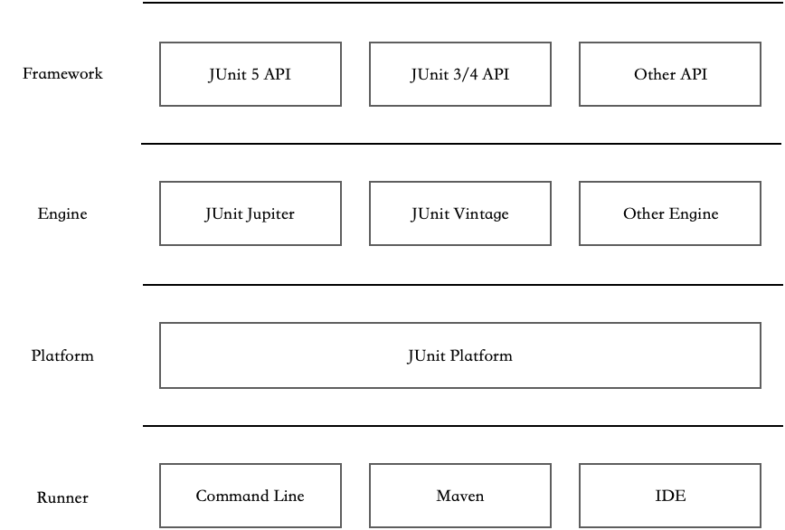

第 3 章 单元测试基础
====================

单元测试是研发人员必须掌握的一项技能，但不是研发自测的全部内容。一些大的公司在面试时，甚至要考察应聘人员的单元测试能力和所写代码的质量。单元测试是开启研发自测的一把钥匙。

本章涵盖的内容有：

-   单元测试基础。

-   断言。

-   JUnit 的使用。

-   JUnit 5 的新特性。

本章的目标是通过学习单元测试相关知识，以最具性价比的方式开启开发人员的自测之旅。

本章的示例代码可以在 Git 仓库（[https://github.com/java-self-testing/java-self-testing-example/blob/main/single](https://github.com/java-self-testing/java-self-testing-example/blob/main/single)）中下载。

## 3.1 单元测试

在介绍繁杂的概念之前，我们先来了解一下单元测试的意义和学习方法。

### 3.1.1 什么是单元测试

```text
在计算机编程中，单元测试又称为模块测试，是针对程序模块（软件设计的最小单位）来进行正确性检验的测试工作。

———— 维基百科
```

什么是一个单元？

在过程化编程中，一个单元就是单个的程序、函数和过程等。面向对象编程时，最小的单元就是方法，包括基类（超类）、抽象类或者派生类（子类）中的方法。

单元是一个相对概念，针对方法、类、模块和应用所进行的测试都可以称作单元测试简单来说，单元测试的初衷是对应用的一小部分及时进行测试，而非等到所有的代码编写完之后再针对整个应用进行测试。

综上所述，单元测试是基于类、方法层面的，与之相对的是集成测试、E2E 测试。

### 3.1.2 为什么需要写单元测试

在没有接触单元测试之前我们是怎么做测试的？一般有两个方法：

1）启动整个应用，像用户正常操作一样，先单击界面上的按钮，然后查看程序的反应。这种手动测试的弊端是每次测试都得启动整个应用，项目稍微大一点响应就会变得非常慢，如果面对的是 PHP、Node.js
等脚本语言还好，如果是 Java、C++ 这类编译型语言则会非常痛苦。

2）在代码的某个地方写一个临时人口，例如在 Java 的 main 方法中测试某个方法或者某个类，用完留在项目中或删除。但是，不删除会让项目变得很乱，删除的话下次想测试又得再次编写。

这两个方法有一个共同的问题，没法保留测试数据的创建过程，且场景、边界的覆盖基本随缘。单元测试本质上就是方法 2，即把类似 main 方法的测试代码统一放到一个地方，然后根据一些约定让代码更简洁，但不会强制要求你把测试代码放到某个地方。

在 Java 项目中，根据 Maven 项目结构有如下约定：

-   测试代码单独放到 src/test 目录下，与 src/main 中的业务代码一一对应。
-   测试类和业务类同名，且均采用 Test 作为结尾。

理论上不使用任何测试框架也可以实现单元测试，最初的单元测试就是这样实现的。不过现在利用 xUnit 等框架可以更方便地运行测试。使用框架的单元测试有以下好处：

-   方便批量运行和管理测试。
-   可使用 @Before 等钩子实现数据准备、数据清理。
-   可通过断言验证结果，避免人工判定结果。
-   可通过覆盖率统计工具来统计代码测试的覆盖率。
-   可通过模拟解决代码之间相互依赖的问题。

当然，编写单元测试的目的除了测试方便之外，还有一个重要的用途：重构。

重构是单元测试非常重要的一个用途。在某些场景下，我们需要改造一些遗留代码，并且要让其近乎 100% 地保持原来的逻辑。但是，如果没有单元测试的保护，开发人员基本不敢重构，只能通过添加代码来实现业务目标，这会导致代码越来越混乱。如果在重构前，已通过单元测试将原来的业务逻辑覆盖，在有保护的情况开始重构，重构完成后再次运行单元测试也能通过，则说明这次重构基本上没有破坏性。

在 Java 中 JUnit 是单元测试套件，我们可以从最简单的单元测试开始对应用的一个方法进行验证，而不必启动整个应用。

### 3.1.3 怎么学习单元测试

软件的质量是由每一行代码的质量决定的，细微处的 Bug 积累起来终将导致大问题，所以，在细微处进行单元测试能很好地避免大问题的产生。

我刚接触单元测试时，项目正处于一个 Bug 丛生、开发人员永远在当救火队员的状态。在熟悉了一些测试框架后，我将其大量应用于项目中，但是结果并不理想。单元测试的理念需要逐步培养，一开始就使用非常复杂的工具、库，或进行 TDD 等高难度的实践，会导致学习曲线太过陡峭，在项目中很难坚持。

因此，这里给单元测试的初学者一些建议：

-   学习一些简单的单元测试方法后，马上应用到项目中，再按照需要学习其他技巧。
-   刚开始尽量使用主流或者平台内置的框架或库，例如 IntelliJIDEA 可以很容易地引入 JUnit。选用 JUnit 是非常划算的事情，它自带了 Hamcrest
    断言库，因此没有必要一开始就使用 AssertJ 等更复杂的断言库。
-   根据二八原则，80% 的代码都是很好测试且性价比高的，可优先选择为它们编写测试。
-   不必苛求测试覆盖率，有一些代码测试覆盖率很难提升，追求 100% 的代码测试覆盖率性价比非常低。

本书的编写思路也是如此。学完本章内容以后，读者应该就可以在项目中应用 JUnit 了，并且可以针对一些使用次数多的公共方法（一般是静态方法）编写测试。后续章节则会介绍如何为 Spring 的 Bean 编写单元测试，如何使用各种私有方法以及需要插桩处理的方法，最后才给出各种高级的理念，比如 BDD、JMH、并发测试等。

另外，可选择的单元测试相关技术非常多，限于篇幅，本书无法将所有技术和框架都介绍到，所以选择了一套最主流的技术栈进行讲解。掌握了这套技术栈后，自然也能拓展使用其他的技术栈。

本书的技术栈主要包括 Java、Maven、JUnit、Mockito 以及相关的开源工具（在附录中可以找到开源工具清单）。

### 3.1.4 搭建 JUnit 环境

Java 生态的测试框架比较多，JUnit 4 是目前最主流也是搭建最为简单的测试框架之一。下面的内容将基于 JUnit
4 进行讲解，这里假定你已经有 Java 开发经验，并能熟练使用 JDK、IntelliJIDEA、Maven 等工具。如果你习惯使用 Eclipse、Gradle，也可以花一点时间了解一下 IntelliJIDEA、Maven
这两个工具，它们都非常简单易用。

搭建好 Java 开发环境后，依次选择菜单 File→New→Project，然后选择 Maven 标签页创建一个项目，如图 3-1 所示。


图 3-1 创建一个项目

创建完 Maven 项目后可以在项目的根目录中找到 pom.xml 文件，使用 JUnit 只需要在 pom.xml 文件中的 dependency 节点添加依赖即可：

```xml
<dependency>
    <groupId>junit</groupId>
    <artifactId>junit</artifactId>
    <version>4.13</version>
    <scope>test</scope>
</dependency>
```

注意，将 dependency 中的 scope 属性设置为 test，这样在构建产生的软件包中会自动排除 JUnit 的 Jar 包。如果在创建 Maven 项目的过程中遇到困难，可以参考随书示例代码。

### 3.1.5 给 "Hello, world!" 写一个单元测试

大部分人学习编写的第一个程序就是 "Hello，world！"，通过编程语言简单输出字符串 "Hello，world！" 代表学会了编写第一个程序，也标志着编程环境搭建成功。那我们就来给 "Hello，world！" 写一个单元测试。

先编写一个类，这个类只有一个静态方法，方法被执行后输出字符串 "Hello，world！"：

```java
public class HelloWorld {
    public static String hello() {
        return "Hello, world!";
    }
}
```

静态方法一般是一些工具方法，它也是最容易测试的方法之一。工作中，我经常看到有人在静态方法附近编写一个 main 函数，然后调用这个方法来测试。示例如下：

```java
public static void main(String[] args){
    System.out.println(hello());
}
```

就像前面所说的，这里采用的是一种朴素的单元测试思想。我们可以使用一个测试类和 @Test 注解代替 main 函数作为启动入口。先创建一个类 HelloWorldTest，并为其添加一个 public 方法，然后添加 @Test 注解，这时，IDEA 会自动识别这是一个可执行的测试，我们可在这个方法内调用被测试的静态方法，并打印出来。

在图 3-2 中，点击左侧圈出来的执行按钮，可以像 main 函数一样执行右侧的代码，并得到同样的输出结果。我们还可以给予这个测试方法一个有语义的名字，使单元测试更整洁，并拥有更强的描述性。


图 3-2 运行测试

这样，我们的第一个单元测试就写好了。不过这时我们是通过肉眼来判断程序每次的输出是否正确的，当有几十、上百个测试用例运行时，再使用这种方式显然不现实。

因此我们需要在测试的代码中定义出什么是对的，什么是错的，这时就需要用到断言了，它可以自动报告不能通过的测试。

## 3.2 断言

计算机是一种特别讲究准确性的机器，计算机程序对准确性的要求更高，少了一个符号或者单词拼写错误往往就会让程序出现意想不到的结果，我相信不少人有过因一个单词拼写错误就 Debug 一整天的经历。

事实上，单元测试可以帮我们检查程序的输入是否正确，并重复运行，只 ** 需要告诉单元测试什么是对的，什么是错误的即可，这就是断言 **。

在一些 "讲究" 的程序员眼里，"Hello，world！" 是神圣的，假设在标准写法中 "H" 需要大写，句子中间要用半角逗号隔开，并且要以感叹号结束，那么，我们可以通过断言来检测这个方法的输出是否完全无误。下面编写第一个断言，将前面代码中的 System.out.
println 语句替换为 assertEquals 语句，示例代码如下：

```java
@Test
public void should_return_world_as_string() {
    Assert.assertEquals("Hello,world!", HelloWorld.hello());
}
```

在上述代码中，assertEquals 方法的第一个参数是期望的值，第二参数是真实的值。如果这两个值相等，测试通过，控制台为绿色。如果把方法的返回值换成了另外一个字符串 "Hello，world！"，肉眼看可能觉得并没有任何问题，但是运行测试时会失败。原因仅仅是这里把中间的英文半角逗号换成了中文的全角逗号，它们虽然看起来差不多，但是值却是不同的。单元测试没有通过，意味着它成功地帮助我们保护了被测试的代码。仅仅使用 System.out.println 是起不到这个作用的。

** 综上所述，断言就是用来报错的，它在单元测试中是非常重要的一部分。**

### 3.2.1 编写一个简单的断言库

如果我们在做编程练习时手上没有现成的断言工具，比如在浏览器上编写 JavaScript 的代码时很难快速找到一个测试框架，那么可以编写一个方法来进行测试：

```javascript
function assertEquals(description, expected, actual) {
    if (expected !== actual) {
        throw new Error("ComparisonFailure, Expected:" + expected + ",Actual:" + actual);
    } else {
        console.log(description + " : %c  passs", "color:#0f0;")
    }
}
```

这就是一个最简单的断言库，这个库只有一个方法，它会判断期望的值和实际的值是否相等，如果不相等就抛出异常，否则在控制台上打印出绿色的成功了的信息。

下面根据这个简单的断言方法编写一个测试：

```javascript
function should_return_hello_world(){
    assertEquals("test hello world", "Hello", "Hello");
}
```

可以看到，单元测试的逻辑实际上非常简单，我们在几分钟内就可以完成一个简单的单元测试断言库。早期有部分开源软件没有特定的单元测试框架，会内置一个微小的断言库。

### 3.2.2 JUnit 内置的断言方法

在实际项目中，只有 "相等" 这种断言方法是远远不够的。有的对象并不能直接使用 assertEquals 进行比较，而是要用到属性的值，因此也就衍生出更多的断言方法，比如：

-   空或者非空断言。

-   引用相等断言。

-   数组相等断言。

-   对象的嵌套相等断言。

-   根据类型断言。

我们可以把这些断言逻辑写到单元测试的方法中，然后通过 assenTrue 来验证结果。assertTrue 是 JUnit 中的万能断言方法，它通过传入 true 或者 false 来决定测试是否通过。这看起来并没有什么问题，但是在部分情况下断言逻辑都是重复的，而且单元测试写了一大堆的逻辑，这些逻辑是否又需要编写新的测试来保护呢？如果我们不使用现成的断言库，就不能确保断言本身的逻辑是否可靠。因此对于断言的这部分逻辑来说，应该使用 JUnit 提供的断言方法提高单元测试的有效性，这么做也能减少样板代码。

如果我们编写了一个排序方法，想通过断言来对结果进行判定，那么可以使用 assert 系列的方法，这些断言方法可针对不同情况进行测试，能满足不同的需求。

assertArrayEquals 可以用于断言数组，它会依次比较数组中的元素，示例代码如下：

```java
@Test
public void assert_array_equals() {
    int[] input = {1, 2, 5, 7, 0};
    Arrays.sort(input);

    int[] expected = {0, 1, 2, 5, 7};
    assertArrayEquals("expected array should be sorted", expected, input);
}
```

assertNotNull 非常实用，常用于数据库插入、枚举解析等业务，示例代码如下：

```java
@Test
public void assert_not_null() {
    assertNotNull("should not be null", Integer.valueOf("10"));
}
```

assertSame 可以用于检查对象引用是否相同，示例代码如下：

```java
@Test
public void should_be_same() {
    assertSame(Runtime.getRuntime（），Runtime.getRuntime（）);
}
```

assertTrue 要求传入一个布尔类型的真，如果是真值则断言通过。示例代码如下：

```java
@Test
public void should_be_true() {
    String hello = "Hello";
    assertTrue(hello.isEmpty());
}
```

assertArrayEquals、assertNotNull、assertSame、assertTrue 这几个方法都有反向断言方法。表 3-1 给出了常用的断言方法以及它们的反向断言方法。

表 3-1 常用的断言方法

| 断言              | 用途                  | 反向断言        |
| ----------------- | --------------------- | --------------- |
| assertEquals      | 值相等断言            | assertNotEquals |
| assertTrue        | 真值断言              | assertFalse     |
| assertNull        | 校验空                | assertNotNull   |
| assertSame        | 校验引用相同          | assertNotSame   |
| assertArrayEquals | 校验数组元素相同      | -               |
| assertThat        | 使用 Matcher 进行断言 | -               |

### 3.2.3 使用 assertThat 和 Matcher

前面给出的断言方法虽然常用，却难以覆盖所有的场景。为了让断言更为丰富，JUnit 使用了更为高明的方法——它提供了一个 assertThat 方法（实际上是 Hamcrest 提供的）。assertThat 方法的第一个参数为需要检查的值，第二个参数是一个函数，这个函数只用来计算条件是否满足。用来计算条件是否满足的函数叫作 Matcher，Matcher 可以由第三方库提供。

Java 中比较知名的 Matcher 库是 Hamcrest 和 AssertJ，Hamcrest 为 JUnit 内置的库，它适用于大部分场景。

例如，想要编写一个 helloAndNow 方法返回 "Hello，world！" 并附加当前的时间，由于时间是动态生成的，因此现在没有办法使用 assertEquals，对于这种情况，就可以使用 assertThat 和 startsWith Matcher 来实现上述方法。示例代码如下：

```java
public static String helloAndNow() {
return "Hello, world!" + System.currentTimeMillis();
}

@Test
public void should_start_with_hello() {
    assertThat(helloAndNow(), startsWith("Hello"));
}
```

表 3-2 是一些常用的 Matcher，使用好 Matcher 可以大幅减少测试的代码量。

表 3-2 常用的 Matcher

| Matcher                | 示例                                                         | 用途                             |
| ---------------------- | ------------------------------------------------------------ | -------------------------------- |
| anything               | assertThat(“hamcrest”,anything());                           | 任何内容，一般只用来占位         |
| describedAs            | assertThat(“hamcrest”, describedAs(“a description”, anything())); | 用来包装一个描信息               |
| is                     | assertThat(“hamcrest”, is((anything()));                     | 其实没有什么用，包装一个语义信息 |
| allOf                  | assertThat(“hamcrest”, allOf(anything(), anything(), anything())); | 串联多个断言                     |
| anyOf                  | assertThat(“hamcrest”, anyOf(anything(), anything(), anything())); | 并联多个断言                     |
| not                    | assertThat(“hamcrest”, not(not(anything())));                | 取反断言                         |
| equalTo                | assertThat(“hamcrest”, equalTo(“hamcrest”));                 | 测试对象 equals 相等             |
| instanceOf             | assertThat(“hamcrest”, instanceOf(String.class));            | 测试对象类型                     |
| notNullValue,nullValue | assertThat(null,nullValue());                                | 测试空、非空值                   |
| sameInstance           | assertThat(Runtime.getRuntime(), sameInstance(Runtime.getRuntime())); | 测试对象引用是否一致             |
| hasItems               | assertThat(Arrays.asList(1,2,3), hasItems(1, 2));            | 断言列表内容                     |

既然使用合适的 Matcher 就可以完成 assertSame 等断言方法的工作，那为什么要重复造一个轮子呢？

这是因为单元测试框架和断言库做的是两件不同的事情。单元测试框架更多的是管理、运行测试以及统计通过率等，Matcher 则用来完成条件判断的任务。Matcher 一般被设计为兼容多个测试框架，如果考虑换测试框架，建议尽量使用 Matcher 完成断言任务，方便迁移。

### 3.2.4 编写自己的 Matcher

如果上述断言仍然无法满足需求，我们也可以自己编写一个 Matcher。比如，一段程序使用系统当前时间时，由于程序运行需要时间，断言时取到的系统时间可能已经不同，因此无法准确地断言相应的时间，那该怎么办？其实只要这个时间戳在一定的范围内，就可以算作通过。对于这种情况，可以编写一个简单的 Matcher 来进行判断：

```java
public class CurrentSystemTimeMatcher extends TypeSafeMatcher<Long> {
    private final long timeWindow;

    public CurrentSystemTimeMatcher(long timeWindow) {
        this.timeWindow = timeWindow;
    }

    protected boolean matchesSafely(Long time) {
        System.out.println(System.currentTimeMillis());
        if (System.currentTimeMillis() <= (time + timeWindow)) {
            return true;
        } else {
            return false;
        }
    }

    public void describeTo(Description description) {
        description.appendText(" current time not in range " + timeWindow);
    }

    /**
     * @param 通过一个时间窗来判定结果
     * @return
     */
    public static CurrentSystemTimeMatcher currentTimeEquals(long timeWindow) {
        return new CurrentSystemTimeMatcher(timeWindow);
    }
}
```

在上述代码中，如果 TypeSafeMatcher 引用出现了问题，可以查看一下 CurrentSystem-TimeMatcher 是否放到了源代码的目录下，而非 test 的目录下。我们一般会将测试的依赖 scope 设置为 test，这些类在源代码模块中无法被引用。

自定义的 Matcher 使用起来和其他 Matcher 是一样的，currentTimeEquals 方法可接受一个时间窗口，只要运行时间在这个时间窗口内，就都可以算作断言通过，示例代码如下：

```java
@Test
public void should_assert_time_with_time_window() throws InterruptedException {
    long now = System.currentTimeMillis();
    assertThat(now, currentTimeEquals(10));
}
```

### 3.2.5 断言并不只是单元测试中的概念

断言并不只是单元测试中的概念，在编写实际的业务代码时也可以大量使用断言。Java
1.4 中就增加了 assert 关键字，用于创建一个断言，此断言常用于检查输入，如果断言未通过，则抛出一个异常。

如果我们要编写一个字符串连接方法，逐个判断输入参数是否为空，这其中需要用到很多的样板代码，那么可以通过断言进行检查，在条件不满足时抛出 AssertionError，这样就可以大大减少样板代码的数量，示例代码如下：

```java
public static String contactString(String first, String second) {
    assert first != null;
    assert second != null;
    return first + second;
}
```

对于上述代码要说明的是，assert 关键字常用于各种框架，但是在业务代码中很少看到，因为超出了本书的范围，这里不再赘述。

### 3.2.6 思考题

我们知道计算机在比较浮点数字时会有精度问题，那么下面哪一个断言会通过呢？

```java
Assert.assertEquals(0.0012f, 0.0014f);
Assert.assertEquals(0.0012f, 0.0014f, 0.0002); 
Assert.assertEquals(0.0012f, 0.0014f, 0.0001);
```

精度问题在实际工作中常常出现，例如我们需要计算价格，结果可能是一个无限小数：

```java
public static float calculateAA(float totalPrice, float counts) {
    return totalPrice / counts;
}
```

在这种情况下，下面的断言就不会通过：

```java
@Test
public void should_assert_with_float_delta() {
    assertEquals(3.3333F, calculateAA(10F, 3F));
}
```

这时，我们需要给出一个 delta
参数，用于表示能容忍的真实值和期望值之间的差异，也就是精确的位数，示例代码如下：

```java
@Test
public void should_assert_with_float_delta() {
    assertEquals(3.3333F, calculateAA(10F, 3F), 0.1);
}
```

想进一步了解 delta 参数，可以查看 assertEquals 的源码。

## 3.3 单元测试的结构

一个优秀的单元测试，除了具备前面介绍的断言外，还需要准备清晰的测试数据，并清理测试数据相关的逻辑，这些逻辑共同构成了一个测试用例。下面将介绍一个完整的单元测试有哪些内容。

### 3.3.1 准备数据和清理数据

前面的示例使用的是静态方法，但是在 Java 中这种简单的使用场景比较少，大部分情况下需要实例化类、准备初始数据，并且要用到模拟技术（后面会介绍）。

JUnit 针对准备、清理有状态的数据等操作提供了几个非常有用的注解，下面以编写一个简单的字符串拼装器为例，介绍如何通过 @Before 注解来为每次的测试准备数据：

```java
class StringAppender {
    private String value = "";

    public void append(String appendText) {
        value = value + appendText;
    }

    public String getValue() {
        return value;
    }
}
StringAppender stringAppender;

@Before
public void setup() {
    stringAppender = new StringAppender();
}

@Test
public void should_get_text_from_object() {
    stringAppender.append("Hello");
    stringAppender.append(",world");
    assertEquals("Hello,world", stringAppender.getValue());
}
```

JUnit 4 中有如下四个执行过程（钩子）注解。

-   @BeforeClass ：用于类加载首次执行，必须用在静态方法上。
-   @Before ：用在实例方法中，在执行每个测试用例之前执行。
-   @After： 用在实例方法中，在执行每个测试用例之后执行。
-   @AfterClass：在 @After 类似，区别在于 @AfterClass 是以类的维度生效的，即被该注解修饰的方法会在该类包含的全部测试用例运行完之后被执行，必须用在静态方法上。

在 @Before 和 @After 方法之间会执行所有测试用例，它们的执行顺序是：

@BeforeClass → @Before → @Test → @After → @AfterClass

如果有父类的方法出现 @Before、@BeforeClass 等注解，父类会优先执行。可以尝试编写一个测试类，包含下面的代码，并执行一个测试。

```java
@BeforeClass
public static void beforeClass() {
    System.out.println("@BeforeClass");
}

@Before
public void setup() {
    System.out.println("@Before");
}

@After
public void tearDown() {
    System.out.println("@After");
}

@AfterClass
public static void afterClass() throws Exception {
    System.out.println("@AfterClass");
}
```

可以看到结果如下：

```text
@BeforeClass
@Before
@After
@AfterClass
```

### 3.3.2 设计单元测试用例

JUnit 本身比较简单，到目前为止，其内置的特性足够编写大部分依赖简单的测试代码。第 1 章曾介绍过什么是测试用例，这里使用一些实例来说明测试用例在单元测试中的应用。

单元测试的对象一般是方法和组件，也就是说，单元测试是对 "轮子" 的质量进行验证，可想而知，相较于 QA 使用的测试用例，它的测试用例应该略有不同。更准确地说，它的粒度更小，没有太多场景和流程，主要关注等价划分和边界值的选择，且要考虑覆盖更多的分支。

JUnit 中 @Test 修饰的方法就代表了一个测试用例。除了准备数据之外，** 一个测试用例只会对组件的一个特性进行验证 **，这个验证可能包括多次断言，以确保结果正确。

一个测试用例通常包含以下部分：

-   输入数据 ，有时候可能没有。

-   与被测试的方法交互。

-   断言。

可选的部分有：

-   数据准备。

-   数据清理。

接下来我们以回文数作为示例，来验证一个方法是否可靠。

**1. 等价划分和边界分析 **

回文数是指正序（从左向右）读和倒序（从右向左）读都是一样的整数。回文字符串很好判断，但是回文数如何实现呢？我写了一个实现，然后设计了一个测试用例来保证它的可靠性。要特别说明的是，这个方法包含了顺序、分支、循环三种程序结构，具体的实现如下：

```java
public static boolean isPalindrome(int inputValue) {
    if (inputValue < 0) {
        return false;
    }
    int reverseValue = 0;
    int intermediateValue = inputValue;
    while (intermediateValue != 0) {
        reverseValue = reverseValue * 10 + intermediateValue % 10;
        intermediateValue /= 10;
    }
    return reverseValue == inputValue;
}
```

下面先设计一个最简单的测试，输入一个普通的值，比如 8。这个测试很容易会通过，因为单个数字都满足条件。这类简单通过的正向测试叫做 "Happy Path"（第 1 章已介绍）。

```java
@Test
public void should_be_true_if_value_is_eight() {
    // Given
    int inputValue = 8;
    // When
    boolean palindrome = isPalindrome(inputValue);
    // Then
    assertTrue(palindrome);
}
```

如果这个方法被很多人使用，会遇到各种各样的场景，我们需要考虑到各种边界情况，让程序更为健壮。尝试问自己下面的问题：

-   如果这个值是负数，结果是什么呢？

-   如果这个值是 0 ，结果是什么呢？

-   如果这个值是 7 ，结果是什么呢？

-   如果这个值是一个两位数，结果是什么呢？

-   如果这个值是 Java int 类型最大值，结果是什么呢？

-   如果这个值是 Java int 类型的最小值，结果是什么呢？

幸好我们使用的是类型系统完善的 Java，如果使用的是弱类型语言，例如
JavaScript ，那么问题会更多。

设计测试用例的时候，最基础的方法就是使用边界值分析和等价类划分。在上述实现中，0
和 10 非常特殊，思考一下，这两个数字会将数轴划分为哪些边界：

-   最小值到 0 是两个边界。

-   0 到 10 是一个边界。

-   10 到最大值是一个边界。

边界上的输入作为一个测试用例，例如 0、10。边界中间的一些数据，比如 7 和
8， 可以看作是等价的，取其中一个值即可。下面使用表 3-3 进行描述：

表 3-3 边界值分析

| 边界值            | 输入值            | 期望的结果 |
| ----------------- | ----------------- | ---------- |
| Integer.MIN_VALUE | Integer.MIN_VALUE | False      |
| 0                 | 0                 | True       |
| 5                 | 5                 | True       |
| 10                | 10                | False      |
| 11                | 11                | True       |
| Integer.MAX_VALUE | Integer.MAX_VALUE | False      |

表 3-3 一共有 6 个测试用例，能比较充分地考虑到各种情况。由于写完这 6 个测试用例需要占用大量篇幅，因此这里就不再给出示例。在实际工作中遇到这种有固定输入模式的测试用例时，可以想办法减少样板代码，在后面介绍 JUnit 的另外一个特性时会进一步讲解。

2. ** 根据可达路径设计用例 **

另外一种更常用的测试用例设计方法是根据可达路径设计。可达路径是指程序具有不同的数据流动路径，这些路径是基于代码中分支语句的数量来实现的，单元测试应该保证每条路径都能覆盖。

下面以简化版的 Fizz Buzz 为例进行说明，Fizz Buzz 是一个常见的编程练习题，主要考察代码的设计思路。

```text
给予一个整数 n。如果这个数能被 3 整除，返回 fizz。如果这个数能被 5 整除，返回 buzz。如果这个数能同时被 3 和 5 整除，返回 fizz buzz。如果都不满足，返回 null。
```

以下是一个最简单的实现：

```java
public static String simpleFizzBuzz(int n) {
    if (n % 3 == 0 && n % 5 == 0) {
        return "fizz buzz";
    } else if (n % 3 == 0) {
        return "fizz";
    } else if (n % 5 == 0) {
        return "buzz";
    }
    return null;
}
```

如表 3-4 所示，simpleFizzBuzz 方法有 4 条路径，满足各个条件则返回单词，不满足则返回 null。

表 3-4 路径分析

| 路径                     | 用例输入 | 期望结果  |
| ------------------------ | -------- | --------- |
| n % 3 == 0 && n % 5 == 0 | 15       | fizz buzz |
| n % 3 == 0               | 3        | fizz      |
| n % 5 == 0               | 5        | buzz      |
| 其他                     | 10       | Null      |

一个方法的可达路径的数量还可以衡量一段代码的复杂度。可达数量非常多说明这个方法非常复杂，需要相应地增加测试用例的数量，以保证它的可靠性。可达路径非常多而带来的复杂度叫作圈复杂度。

如果一个方法包含的代码比较长，圈复杂度则相对高，如果各种条件语句再组合在一起，那么复杂度会呈指数级上升。一般情况下，圈复杂度在 20 以内比较合适，超出 40 则测试的成本会非常高。

单元测试以小的颗粒度准备测试用例，组合要少一些，如果将多个方法合并测试，那么需要组合的条件就非常多了，这样复杂度就会叠加。这也是单元测试的成本要远远低于集成测试和
UI 测试的原因。

### 3.3.3 参数化测试用例

如果按照前面介绍的方法进行测试用例设计，设计出的测试用例往往会非常多。以回文数（见表 3-3）为例，共有 6 种输入数据，如果每一行对应一个单元测试，那么测试代码会无比冗长。

对于上述情况，我们可以通过使用 Parameterized 输入一组二维数组来进行改善：

```java
@RunWith(Parameterized.class)
public class ParameterizedPractiseTest {
    @Parameterized.Parameters
    public static Collection<Object[]> data() {
        return Arrays.asList(new Object[][]{
                {Integer.MIN_VALUE, false},
                {0, true},
                {5, true},
                {10, false},
                {11, true},
                {Integer.MAX_VALUE, false}
        });
    }

    private int input;

    private boolean expected;

    public ParameterizedPractiseTest(int input, boolean expected) {
        this.input = input;
        this.expected = expected;
    }

    @Test
    public void test() {
        assertEquals(expected, isPalindrome(input));
    }
}
```

实际上这里只是使用了一种语法糖，通过 @RunWith 注解输入 Parameterized Runner，帮助生成 6 个独立的测试。在这个例子中需要用到 Runner，Runner 是 JUnit 的一种拓展方式，可以将其看作测试用例的管理器。在后续的部分我们会切换各种各样的 Runner 来满足特定的需求，源码分析部分则会介绍它的实现细节。@Parameterized.Parameters 定义了 6 条数据作为输入、输出信息。这个注解允许传入一个模板给 6 个独立的测试输出相应的名称，便于识别。

我们可以将参数组合到测试用例的名字中，下面这段代码可以用于定义生成的测试用例名称：

```java
@Parameterized.Parameters(name = "{index}_input_({0})_should_be_{1}")
```

现在我们在控制台就可以看到 6 个独立的测试了，运行结果如图 3-3 所示。


图 3-3 参数化测试运行结果

Runner 是 JUnit 中比较高级的技术。另外一个第三方 JUnitParamsRunner 可以直接将 Parameters
注解组合应用于测试方法上，这样显得更为简洁。

要使用 JUnitParamsRunner 需要通过 Maven 自行导入，示例如下：

```java
@RunWith(JUnitParamsRunner.class)
public class PersonTest {

  @Test
  @Parameters({"17, false", 
               "22, true" })
  public void person_is_adult(int age, boolean valid) throws Exception {
    assertThat(new Person(age).isAdult(), is(valid));
  }
}
```

## 3.4 JUnit 的其他使用技巧

由于在编写测试的过程中会出现一些额外的情况，比如发生异常该如何处理等，因此下面会介绍一些方法来应对。

### 3.4.1 测试异常

异常是实现业务逻辑时常用的错误处理机制，单元测试往往需要覆盖各种异常情况，否则测试的意义会大打折扣。对异常断言有以下几种方式：使用 @Test 注解中的 expected、使用 assertThrows 断言工具或 Rule 等。

下面以 LeetCode 中的题目 "两数相除" 为例来练习编写单元测试。

给定两个整数，被除数 dividend 和除数 divisor。将两数相除，要求不使用乘法、除法和 mod 运算符。返回被除数 dividend 除以除数 divisor 得到的商。

这里用了一个最容易理解的算法，即通过循环做减法来实现除法，示例代码如下：

```java
public static int divide(int dividend, int divisor) {
    int result = 0;
    float remainder = dividend;
    while (remainder >= divisor) {
        result++;
        remainder = remainder - divisor;
    }
    return result;
}
```

不过这段代码有一个致命的漏洞，如果传入的 divisor 为 0 就会出现死循环。因此我们需要增加处理这种场景的异常，即不允许被除数为 0，在下面的代码中，DivideByZeroException
是一个空的异常，继承自 RuntimeException。

```java
if (divisor == 0) {
    throw new DivideByZeroException();
}
```

接下来编写测试进行验证，确保代码安全。

#### 1. 使用 @Test 注解中的 expected 参数

@Test 提供的可选参数 expected 可以非常简单地实现对异常的断言，这个参数只能传入 Throwable 的子类。示例代码如下：

```java
@Test(expected = DivideByZeroException.class)
public void should_get_error_when_divisor_is_zero() {
        assertEquals(3, divide(9, 0));
}
```

这是一种偷懒的方法，expected 无法断言该异常的具体值和消息，如果方法内部不止一个地方抛出了相同的异常，则无法准确地断言期望的异常。因此建议尽量考虑其他的方式来测试异常。

#### 2. 通过 try/catch 测试异常

如果你的 JUnit 版本过低，或者条件受限，一个用于测试异常的小技巧就是使用 try/catch + fail() 方法。

为了让断言准确处理异常信息，首先改造 DivideByZeroException，增加一个构造方法，以便可以传入一个消息，示例代码如下：

```java
public class DivideByZeroException extends RuntimeException {
    public DivideByZeroException(String message) {
        super(message);
    }
}
```

下面这行代码会给丢出异常的地方加上消息。

```java
throw new DivideByZeroException("divisor is zero");
```

使用 try/catch 语法可以获得完整的异常实例，进而实现异常的断言，示例代码如下：

```java
@Test
public void test_exception_by_try_catch() {
    try {
        divide(9, 0);
        fail("Expected DivideByZeroException be thrown");
    } catch (DivideByZeroException divideByZeroException) {
        assertThat(divideByZeroException.getMessage(), is("divisor is zero"));
    }
}
```

在上述代码中，我们期望 divide(9, 0) 抛出异常，让测试通过。如果没有抛出异常，就会走到后面的 fail 方法中，fail 方法的作用是告诉 JUnit 测试未通过。需要注意的是，fail 非常重要，没有它就起不到断言的作用。

#### 3. 使用 Rule 测试异常

@Rule 是一种提前声明的机制，它可以先声明一些期望，然后再执行业务代码，一般用于一些特殊场景，示例代码如下：

```java
@Rule
public ExpectedException thrown = ExpectedException.none();

@Test
public void test_exception_by_rule() throws IndexOutOfBoundsException {
    thrown.expect(DivideByZeroException.class);
    thrown.expectMessage("divisor is zero");
    divide(9, 0);
}
```

这个机制可以用来测试异常，由于它被定义为类级别，使用起来比较麻烦，因此已经不推荐使用，大多数情况下更推荐使用 assertThrows 来测试异常。

####  使用 JUnit 5 的新特性

JUnit 5 提供了一些新的断言能力，可以结合 Java 8 的 Lambda 表达式来实现更为方便的断言，具体将在后面介绍。

### 3.4.2 测试覆盖率

如果我们的测试用例设计得不好，或者不够多，必然会有很多分支和情况没有考虑到。对此，我们可以通过统计测试覆盖率和覆盖情况来检验测试用例的设计，从而进行改善。

IDE 内置的测试覆盖率统计工具可以帮助我们统计，只需要使用 Run xx with Coverage 即可完成。例如，IntelliJ IDEA 不仅可以针对类统计测试覆盖率，还可以选中针对的包统计单元测试覆盖率，如图 3-4 所示。


图 3-4 通过测试覆盖率启动器运行

测试覆盖率统计工具运行完以后，IntelliJ IDEA 会弹出一个统计窗口，同时代码编辑器也会显示出哪些代码已被覆盖，如图 3-5 所示。


图 3-5 测试覆盖率统计

覆盖率分为类、方法、分支覆盖率和行覆盖率，一般项目会要求类和方法的覆盖率达到 100%，行和分支的覆盖率到 80%。其实覆盖率的主要指标应该是分支覆盖率，了解分支覆盖率可帮助我们进一步完善测试用例。

在工程化方面，我们可以使用 Maven Surefire 插件和 JaCoCo 来运行测试并获取测试覆盖率，同时上传报告，这些内容在工程化部分会说明。

### 3.4.3 JUnit Rule 使用

JUnit Rule 提供了→种类似拦截器的机制，用于拓展 JUnit 的功能，它可给每个测试添加一些通用的行为。其常见的用途有全局设置超时时间、获取当前的测试名称、打印日志等。

JUnit 官方网站上给出的部分示例不是很常用，例如，它提到 TemporaryFolder 这个 Rule 提供了一个文件模拟机制，但是更好的做法是使用模拟工具来实现此模拟机制。还有一个例子就是前面提到的通过 Rule 来完成异常测试，已不推荐使用。关于 Rule 的用法，后面会讲到一个通过 Rule 实现超时的技巧。

下面来看一个使用 Rule 的简单例子。TestName 是一个获取测试名称的 Rule，在下面这段测试代码中，每个测试都会在运行期应用这个 Rule，并将当前的信息传递给 Rule，通过这种方式即可获得测试名称。

```java
public class NameRuleTest {
  @Rule
  public final TestName name = new TestName();
  
  @Test
  public void testA() {
    assertEquals("testA", name.getMethodName());
  }
  
  @Test
  public void testB() {
    assertEquals("testB", name.getMethodName());
  }
}
```

一般情况下，我们用到 Rule 的地方不多，但是需要知道这种机制的存在，便于在需要的时候实现一些全局逻辑，提高效率。

例如，我们可以给每个测试生成一个专用的日志对象，以便记录测试过程中的信息：

```java
public class TestLogger implements TestRule {
  private Logger logger;

  public Logger getLogger() {
    return this.logger;
  }

  @Override
  public Statement apply(final Statement base, final Description description) {
    return new Statement() {
      @Override
      public void evaluate() throws Throwable {
        logger = Logger.getLogger(description.getTestClass().getName() + '.' + description.getDisplayName());
        base.evaluate();
      }
    };
  }
}
```

### 3.4.4 其他技巧

#### 1. 忽略测试

如果因为某些原因（可能是快速修复 CI，避免影响团队其他成员的工作），你需要快速忽略测试，那么请尽量不要使用大面积注释代码的方法。建议使用 @lgnore 注解，并加上原因，且在方便的时候及时进行修复。

与删除、注释代码不同，@Ignore 会被测试框架作为已经被忽略的测试统计并显示。示例代码如下：

```java
@Ignore("Test is ignored as a demonstration")
@Test
public void assert_same() {
    assertThat(1, is(1));
}
```

#### 2. 测试超时

如果一个测试运行的时间很长，往往意味着这个测试已失败。JUnit 提供了一种方式结束它，即使用 @Test 注解的 timeout 参数传入一个毫秒数。

如果这个测试的运行时间超过了 timeout 允许的时间，JUnit 会中断测试线程，标记测试失败，并抛出异常。需要注意的是，如果测试代码无法被中断，JUnit 会启动另外一个线程来发出中断信号。示例代码如下：

```java
@Test(timeout = 1000)
public void test_with_timeout() {
... 
}
```

timeout 参数只会针对单个测试的超时时间进行检查，如果想要一次性对所有的测试都应用这个规则，可以使用 Rule。示例代码如下：

```java
public class GlobalTimeoutPractiseTest {
    @Rule
    public Timeout globalTimeout = Timeout.seconds(10);

    @Test
    public void test_sleep_11_seconds() throws Exception {
        Thread.sleep(11000);
    }

    @Test
    public void test_sleep_12_seconds() throws Exception {
        Thread.sleep(12000);
    }
}
```

在上述代码中，Timeout Rule 定义了一个全局的 Rule，在当前的类下有效，同时会计算 @Before、@After 方法的运行时间。但是，如果被中断的方法是死循环造成的，那么 JUnit 就会直接停掉，@After 方法可能不会被执行。

#### 3. 聚合测试套件

有时候需要将一组测试用例组合起来作为一个测试套件运行，这可以通过将 Suite 作为 Runner 来实现，即通过 @Suite.SuiteClasses 传入需要组合的测试类来实现单元测试套件。示例代码如下：

```java
@RunWith(Suite.class)
@Suite.SuiteClasses({
        HelloWorldTest.class,
        AssertPractiseTest.class
})
public class SuitesPractiseTest {
    
}
```

### 3.4.5 新手容易犯的错误

#### 1. 找不到单元测试

显示 "No tests found（找不到单元测试）"，这有可能是以下原因造成的：

-   单元测试的方法被设置为了 private，修改为 public 即可。不过，在 JUnit 5 中已修改了相应的实现机制，不需要添加方法的 public 修饰符，因此不会存在这个问题。
    
-   Classpath 中可能存在多个版本的 JUnit 包。

#### 2. initialization error 初始化失败

这种情况发生在 IntelliJIDEA 中，测试运行一次后把 @Test 注解注释掉了，再次运行就可能出现这种情况。原因是 IntelliJIDEA 识别出了它们是同一个测试，但是启动器（在源码分析部分会介绍测试是如何启动的）没有识别出来。遇到这类问题，也可以检查一下 @Test 注解引入的包路径是否正确，即是否为 JUnit 包下面的注解。

#### 3. IntelliJ IDEA 中不出现执行按钮

出现这种情况，有可能是 JUnit 没有被 IntelliJIDEA 识别，建议先检查 Maven 是否拉取了正确的依赖，然后尝试重新加载 Maven 的依赖，并重启 IntelliJIDEA。

#### 4. 明明加载了 JUnit 的依赖，但是 @Test 还是爆红

如果在 Pom 文件中依赖的 scope 属性被定义成了 test，但是测试类被创建到了源代码的目录中，那么 JUnit 的相关类和注解是无法使用的。

在这种情况下，建议继续保持 scope 为 test，并把测试类移动到 test 模块下，参考后面的 Java 单元测试的约定和原则，避免类似的问题再次发生。

## 3.5 基于 JUnit 5 实现测试

前面的内容都是基于 JUnit 4.3 进行讲解的，这是 JUnit 最经典的一个版本。2017 年，JUnit5 发布，它和之前的版本有较大的差异，尤其是架构上，它被拆分为了 3 个子项目。

简单来说，JUnit5 不再是一个简单的测试框架，而是一个测试平台，允许接入其他的测试框架。JUnit 5 在带来更多功能的同时，也变得更为复杂，对新手并不友好，这也是前面没有使用它作为基础教程的原因。不过 JUnit5 还是值得一学的，好在 JUnit5 向下兼容了 JUnit 4，两者在使用上不会有太大差异，后续的内容将切换到 JUnit5 上进行讲解。

### 3.5.1 JUnit 5 的架构说明

使用 JUnit 5 时需要单独引入 3 个包，这 3 个包为 JUnit5 的 3 个子项目。可以用一个公式来理解 JUnit 5：

JUnit 5 = JUnit Platform + JUnit Jupiter + JUnit Vintage。

图 3-6 为 JUnit5 的架构示意图。JUnit Platform 是在 JVM 上启动测试框架的基础，用来启动测试引擎。它提供了不同启动接口，比如命令行、Maven、Gradle、IDE 等。另外，它允许接入各种测试引擎。

JUnit Jupiter 提供了新的编程模型，此模型为 JUnit5 的核心，它内置了一个测试引擎。

从字面意思来看，Vintage 就是指过时，可想而知，JUnit Vintage 用于对旧的 JUnit 版本提供兼容。



图 3-6 JUnit 5 架构

JUnit5 的架构让单元测试的运行变得更加灵活，另外 Jupiter 在反射能力方面也有一些提升，当你处理一些私有属性和方法时就可以感受到。

### 3.5.2 使用 JUnit 5

JUnit5 的使用和 JUnit
4 的差异不大，注意要从新的包中引入注解和断言，但是这有可能会给新手造成困惑，这也是本书从 JUnit
4.3 讲起的原因。

下面照例新建一个 Java 模块，命名为 JUnit5，然后在 Pom 文件中加入依赖：

```xml
<dependency>
    <groupId>org.junit.jupiter</groupId>
    <artifactId>junit-jupiter-api</artifactId>
    <version>5.7.1</version>
    <scope>test</scope>
</dependency>
<dependency>
    <groupId>org.junit.jupiter</groupId>
    <artifactId>junit-jupiter-engine</artifactId>
    <version>5.7.1</version>
    <scope>test</scope>
</dependency>
```

如果我们不需要保留对 JUnit 4 的兼容，可以不加入 JUnit Vintage 包，只需要在新的包路径下使用相关 API 即可。

下面编写一个和前面一样的 HelloWorld 类，以及关于 HelloWorld 的测试，在新的测试中使用的是 org.junit.jupiter.api 包中的注解：

```java
import cn.prinf.demos.junit.jupiter.HelloWorld;
import org.junit.jupiter.api.Test;

import static org.junit.jupiter.api.Assertions.assertEquals;

public class HelloWorldTest {

    @Test
    public void should_return_world_as_string() {
        assertEquals("Hello, world!", HelloWorld.hello());
    }
}
```

在 Jupiter 中，Assertions 代替了原 JUnit 包中的 Assert 类，并提供了更为丰富的功能。虽然在日常工作中 JUnit 4.3 的断言库已经够用，但有更多的选择也不是坏事。JUnit5 提供的注解与 JUnit4.3 类似，不过有几个注解发生了变化，具体如下：

-   @Test 注解的职责变得单一，它不再提供一些主要的属性，这些由单独的注解提供，比如 @Timeout
    注解。
    
-   @Timeout 提供与原来 @Test 注解中 timeout 属性同样的功能。

-   @Before 和 @After 分别被替换成了 @BeforeEach 和 @AfterEach。

-   @BeforeClass 和 @AfterClass 分别被替换成了 @BeforeAll 和 @AfterAll。
    
-   @Disabled 忽略了测试类和方法，和原来的 @Ignore 一样。

-   @RepeatedTest 可以让测试重复运行，但实际用到的地方不多。

### 3.5.3 更强的断言能力

JUnit5 带给人的最直观的感受就是断言能力的提升，尤其是支持 Java8 的 Lambda 表

达式，让很多断言变得极其简单。

例如，我们在使用 JUnit 4.3 时，如果想声明测试方法的异常，需要定义 Rule，或者用 @Test 注解中的 expected 属性声明。而在 JUnit 5 中，直接用 Assertions.assertThrows 包裹被测试的代码即可断言。

下面基于 JUnit5 assertThrows 改写前面介绍异常断言时的例子：

```java
@Test
void should_assert_exception_type_and_message() {
    DivideByZeroException divideByZeroException = assertThrows(DivideByZeroException.class, () -> divide(9, 0));
    assertEquals("divisor is zero",divideByZeroException.getMessage());
}
```

上述代码会根据返回的异常实例进行断言，验证消息和原因是否正确，且能够在引发异常后对其他信息进行断言。另外，还可以在这个测试中编写更多的异常断言，且不需要再开启一个测试。

Assertions.assertTimeout 也可以提供和 Assertions.assertThrows 同样的效果。

### 3.5.4 嵌套的测试

JUnit 5 提供了嵌套的测试风格，即允许在测试类中编写嵌套类来组织测试。一般情况下，我们会将业务类和测试类一一对应，不过有时候一些上下文关系的测试可以合并到一起，避免测试类的数量 "爆炸"。此外，Junit 5 还可以把需要相同测试数据的类放到一起，以便更好地组织测试代码。来看个示例：

```java
import cn.prinf.demos.junit.jupiter.HelloWorld;
import org.junit.jupiter.api.DisplayName;
import org.junit.jupiter.api.Nested;
import org.junit.jupiter.api.Test;

import static org.junit.jupiter.api.Assertions.assertEquals;

public class NestedTest {

    @Test
    @DisplayName("Normal test")
    public void should_return_world_as_string() {
        assertEquals("Hello, world!", HelloWorld.hello());
    }

    @Nested
    @DisplayName("Nested testing demonstration")
    class NestedInnerDemoTest {

        @Test
        void first_test() {
            System.out.println("this is first nested test");
        }


        @Test
        void second_test() {
            System.out.println("this is first nested test");
        }
    }
}
```

测试运行后的截图如图 3-7 所示，可以看到测试描述呈层次状显示。


图 3-7 嵌套测试运行结果

### 3.5.5 拓展的变化

在 JUnit 4.3 中，一次只能使用一个 Runner，在 JUnit 5 中将 @RunWith 换成了 @ExtendWith，另外 @Rule 也被移除了。原因是原来的 @RunWith 有诸多的限制，想要定义多个运行器会很麻烦，所以不得不使用 @Rule 来实现。在 JUnit5 中，这一点已经得到了处理，故而 @Rule 也就无用武之地了。

例如，使用 Spring Runner 运行测试，在 JUnit4.3 中看起来是这样的：

```java
@RunWith(SpringRunner.class)
public class MySpringUnitTest {
    // ...
}
```

在 JUnit 5 中就是这样的：

```java
@ExtendWith(SpringExtension.class)
class MySpringUnitTest {
    // ...
}
```

@ExtendWith 不仅可以支持多个 Extension，还可以放置到测试方法上，在 JUnit 4.3 中 @RunWith 只能用在类上面。

3.6 Java 单元测试的约定和原则
-----------------------------

很多网友和同事曾问我，怎样的单元测试才算一个比较好的测试。对于团队开发来说，只要是有效的、容易维护的测试就是好测试。因此单元测试应尽量轻量级，且应坚持做下去。

为了让团队对单元测试有一个统一的认识和理解，下面基于 FIRST 原则（FIRST 和 AIR 原则为单元测试的两种描述方式）整理了一些约定。

### 3.6.1 FIRST 原则和解释

#### 1. 快速（FAST）原则

单元测试应该是可以快速运行的。它作为非常细粒度的测试，需要能快速运行完一个测试用例。如果不能，可能是粒度过大。

#### 2. 独立（Independent）原则

单元测试的每个用例应该是独立的，用例之间不能相互干扰和依赖，并与顺序无关。可以通过 setup 和 teardown 方法来保证。另外，也不应强依赖外部环境，要尽量和环境隔离。

#### 3. 可重复（Repeatable）原则

单元测试的每个用例都要可以被重复运行，并且每次运行要能得到同样的结果。另外，要能在不同的环境上运行，例如在其他团队成员的开发设备上。

#### 4. 自我验证（Self Validating）原则

单元测试的每个用例运行结果要通过断言验证，不应通过人工验证。

#### 5. 及时（Timely）原则

单元测试每个用例的运行结果要通过断言验证，不应通过人工验证。

### 3.6.2 单元测试的约定

在团队中，单元测试中的代码要和业务代码一样保持统一、整洁。下面整理了一些约定及规范。

-   测试用例的方法名称使用下划线，并且要表达出一个完整的句子，单元测试可以作为 "活" 文档。
-   测试文件要和业务代码类一一对应，并且要放置到和业务代码同级的测试模块中，例如 "src/test/java"，这样 IDE 工具才可以自动识别，并通过快捷键跳转。
-   测试文件要和业务代码文件同名，且应使用 Test 结束。
-   要按照 Given...When...Then 的风格组织测试代码。
-   测试用例必须有充分的断言语句。
-   不需要特别的设置就能运行单元测试。
-   不允许注释单元测试的方法，如果需要快速跳过，使用 @Ignore 注解。
-   如果改变了全局对象，要使用 @After 注解清理，保持独立原则。
-   如果被测试的类实现了接口，尽量通过接口的类型测试。
-   配置合适的测试覆盖率，要为不同的代码配置不同等级的测试覆盖率。核心代码的测试率应为 100%。
-   通用的准备工作使用相关生命周期注解，避免重复。
-   通用的数据准备工作可以通过提取一个测试助手类来完成。
-   提交代码前保证单元测试已通过。
-   修改业务代码时，要同步修改单元测试，并补充足够的测试用例。

3.7 小结
--------------------------

本章先介绍了单元测试的基础知识，比如如何使用断言、测试异常等，然后介绍了数据准备和清理的方法，接着又讲解了一些使用技巧和诊断问题的方法。任何团队在进行编码时都需要通过一些契约来保证团队的协作顺利。因此，本章的最后整理了一份单元测试的约定，并介绍了单元测试的原则。

单元测试并不是高级工程师的专利，它应该是合格工程师的基本能力。单元测试工具和框架的选用以轻量级、能坚持为原则。一上来就要求 100% 的单元测试覆盖率或者使用一些冷门复杂的框架，不利于团队坚持下去。

1～3 章的内容已经能帮助大家编写大部分工具类库的单元测试。应用程序的代码往往耦合度更高，要为这类代码编写单元测试，则还需要一些其他的技巧，这些将在后文中逐步介绍。
