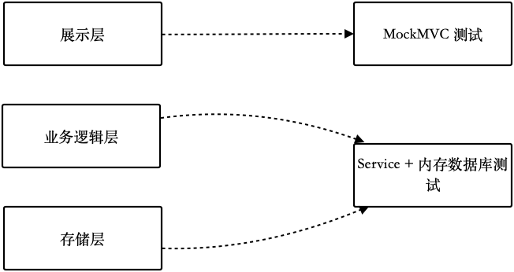

第 5 章 Spring 应用的测试
=========================

为了更好地理解Spring相关的测试内容，这里延续前面购买灯泡的类比。在现代社会中，人们大都使用一些具有装饰性或者功能性的灯具。在这种灯具中，灯泡有可能被放到某个灯槽中，或者被包裹在富有艺术感的金属材料里面。因此，我们也就不得不按照厂商的要求来测试或者组装，以实现相应的功能。

软件开发也是一样，掌握了JUnit和Mockito的相关知识后，虽然可以编写大部分测试，但是如果项目中使用了Spring，它独特的依赖注入方法还是可能会让我们有些无所适从。客观地说，测试需要与业务代码所处的生态环境相结合，这是无法逃避的事实，我们得想办法解决它。

Java开发中目前最流行的体系就是Spring生态，日常工作中需要结合Spring来实现的测试需求非常多，而且比较重要，但大部分讲解单元测试或TDD的图书都很少涉及Spring相关知识。基于此，本章将围绕Spring、Spring
Boot来讲解如何编写单元测试，目标是在 Spring Boot 这种主流的
Spring框架下，充分利用其技术体系来完成测试（不一定只是单元测试）。

我在写这章内容时使用的Spring
Boot版本是2.4，在该版本中，对应的单元测试框架已经是JUnit
5，因此，从本章开始会将JUnit版本切换到JUnit 5。如果读者不熟悉 JUnit
5，可以到第3章查看JUnit 4和JUnit5的区别。

本章涵盖的内容有：

-   Spring测试的配置。

-   分层测试。

-   测试工具集。

值得注意的是，从本章开始，将会慢慢脱离单元测试的范围，在将依赖注入容器、技术设施等组件结合到一起后，我们的测试会更加"接地气"，也不再是纯粹的单元测试了。

本章示例代码见 [https://github.com/java-self-testing/java-self-testing-example/tree/master/spring](https://github.com/java-self-testing/java-self-testing-example/tree/master/spring)。

5.1 理解 Spring 测试体系
------------------------

在Spring技术体系下编写单元测试，有时候会觉得概念比较混乱，难以理解。试着从网上找一些代码贴上去，不知道为什么程序就工作了，出现问题自然也不知道要怎么解决。Spring的每一个子项目（组件）的测试模块都会提供相应的测试工具，比如
Spring对应的有Spring Test模块，Spring Boot对应的有 Spring Boot
Testing模块。对于刚刚开始依赖这些包编写测试的开发者来说，有时分不清哪些类来自哪个包，很容易感到困惑。

图5-1是Spring的生态体系和对应的测试体系的包关系图。


图 5-1 Spring 生态和测试体系

图5-1的左边给出了Spring生态下常用的包，具体说明如下。

-   spring-core是一个依赖注入库，通过依赖注人功能管理各种类。

-   spring-mvc提供了与Web服务器编程相关的功能及MVC模式的实现。

-   spring-security-core是安全框架的核心包，提供了相关的过滤器来实现Web安全和鉴权。

-   spring-boot 是 Spring
    生态的脚手架，它是真正意义上的框架，用于集成整个Spring生态体系，通过spring-boot-autoconfigure来实现自动化的配置，这样我们就不用自己配置了。

-   spring-boot-starter发布了各种依赖的Pom集合，方便将各种依赖包引入项目中。

图5-1的右侧是上述包提供的相应测试模块，以及用于测试的工具。比如，spring-test
提供了用于单元测试的Runner，MockMvc相关的类（spring-mvc属于Spring
Framework，没有单独的测试模块）；spring-boot-test提供了@SpringBootTest这类自动化配置的注解及自动化测试配置；spring-security-test提供了一些模拟用户的工具。

除了Spring体系下的这些包，我们还可能会用到其他一些工具，这些工具于不同的层次提供不同的功能：

-   JUnit：作为单元测试工具它已经成为Java单元测试事实上的标准。

-   Hamcrest：JUnit内置的依赖的断言库。

-   AssertJ：流式断言库。

-   Mockito：模拟工具，用于实现测试替身。

-   JSONassert：用于断言JSON节点，做API测试时用得比较多。

-   JsonPath：可以通过XPath 语法访问JSON。

虽然 Spring Boot 也能用于实现命令行、桌面工具的开发（比如 JavaFX可以和
Spring
Boot结合开发桌面应用），但它主要应用于服务端应用开发，所以大部分相关的测试工具都是为服务端开发准备的。总地来说，我们讨论
Spring Boot的时候，应该将更多的关注放在服务端应用开发上。

在实际项目中，可以有以下测试类型：

-   只使用JUnit就可以测试的简单对象、静态方法类。

-   启动Spring上下文来进行测试。如果被测试对象是纳入IOC容器管理的Bean对象， 需要使用Spring Test 的Runner+Mockito
    隔离被测试的对象，虽然这时需要启动Spring
    上下文，但是容器中只放了必要的被测试对象，因此仍然可以看作是单元测试。

-   启动Spring Boot上下文来进行测试。例如想要测试Controller是否能真正反馈我们
    需要的响应，可以使用Spring Boot Test这个框架启动一个模拟的Spring
    Boot上下文，不过这接近于集成测试，Spring
    Boot文档中也将这部分内容划分为集成测试了。

这三种测试类型，测试的粒度由低到高，测试运行的时间也是由少到多。我们需要尽可能地选用低成本的测试方法，在缩短测试运行时间的同时减少样板代码。

如果需要在 Spring Boot项目加入测试依赖，只需要引入 spring-boot-starter-test 包即可。spring-boot-starter-test基本上引入了需要用到的所有测试功能，已经间接依赖了JUnit、Mockito，开箱即用。

至于测试需要使用的其他依赖包，则需要单独添加，在后面的示例中也会逐步补充说明。由于Spring使用的是统一的依赖版本管理器，因此不需要为Spring组件设置版本，如果希望和本书的代码保持一致，可以选择2.4系列的版本。如果是已经存在的项目，加入下面的依赖到Pom文件中即可开箱使用：

```xml
<dependency>
    <groupId>org.springframework.boot</groupId>
    <artifactId>spring-boot-starter-test</artifactId>
    <scope>test</scope>
</dependency>
```

上面介绍了Spring下的三种测试类型，对于只使用JUnit就可以测试的简单对象、静态方法类，直接使用JUnit和Mockito完成测试即可，无须再讨论。下面聊聊如何使用Spring容器加载Bean进行单元测试和全量启动Spring
Boot的自动化测试配置。

5.2 启动Spring上下文测试 
-------------------------

假设有一个简单的Spring Boot后端
Web项目，里面包含Controller、Service、Entity、Mapper等分层和模块。为了接近国内主流开发风格，其中的持久化库选择了MyBatis。图5-2为示例代码的包结构图。


图 5-2 示例代码的结构

一般来说，主要逻辑都会写在Service中，因此，Service
也就成了我们的主要测试目标。下面将对其编写测试。

UserService中的主要逻辑用于实现添加用户、列出用户等功能，UserService依赖于UserMapper，如果只是测试UserService，然后模拟依赖的Mapper其实非常容易，示例代码如下：

```java
@Service
public class UserService {

    public static final String KEY = "ea416ed0759d46a8de58f63a59077499";

    @Autowired
    private UserMapper userMapper;

    public User add(User user) {
        user.setCreateAt(Instant.now());
        user.setUpdateAt(Instant.now());
        user.setPassword(hash(user.getPassword()));
        userMapper.insert(user);
        return user;
    }

    public List<User> listAll() {
        return userMapper.selectAll();
    }

    private String hash(String text) {
        return new HmacUtils(HmacAlgorithms.HMAC_SHA_512, KEY).hmacHex(text);
    }
}
```

在 Spring 中，常规的做法是使用@Autowired注解来注入依赖的
UserMapper，并将其设置为私有属性。这时需要模拟UserMapper，但由于出现了私有成员，因此无法直接使用Mockito
进行模拟。

在测试替身部分，我们提供了一些方法来解决私有成员的模拟问题。可以使用PowerMock
或者反射工具来实现模拟，比如FieldSetter。在Spring
Test的工具集中还可以使用 Reflection-TestUtils实现类似的效果。

也可以使用Spring的构造方法来注入新模拟的对象，示例代码如下：

```java
private final UserMapper userMapper;

public UserService(UserMapper userMapper) {
    this.userMapper = userMapper;
}
```

当需要被依赖的对象非常多的时候，这样编写代码会稍稍有点麻烦，也无法解决与@Value等类似的注解问题。对于这种情况，在Spring中可以使用SpringExtension来运行测试，并集成Spring的依赖注入功能。

注意：在单元测试部分我们提到了，JUnit 5 中 Runner 被替换成了
Extension，注解 @RunWith 也被替换成了 @ExtendWith。

下面创建一个UserServiceTest测试并使用SpringExtension作为测试的JUnit拓展。由于这个拓展初始化了Mockito注解的相关行为，因此可以实现与MockitoExtension相似的功能，此外，它还提供了与Spring结合更为紧密的其他功能。

创建的基础测试环境如下：

```java
@ExtendWith(SpringExtension.class)
public class UserServiceTest {

    @InjectMocks
    private UserService userService;

    @Mock
    private UserMapper userMapper;
    ...
}
```

下面添加2个测试，用来测试列出、添加用户这两个功能：

```java
@Test
public void should_list_users() {
  userService.listAll();
  Mockito.verify(userMapper).selectAll();
}

@Test
public void should_add_user() {
  User user = new User() {{
    setUsername("zhangsan");
    setPassword("123456");
  }};

  userService.add(user);

  ArgumentCaptor<User> argument = ArgumentCaptor.forClass(User.class);
  Mockito.verify(userMapper).insert(argument.capture());

  assertEquals("zhangsan", argument.getValue().getUsername());
  assertEquals("667f1213e4a57dbee7cd9e8993b82adef1032f7681a5d5c941c30281f90e7eceba629cc9ccf3f133fb478f3f54d9537c2dd50895380f659370c2a14147449ac4", argument.getValue().getPassword());
  assertNotNull(argument.getValue().getCreateAt());
  assertNotNull(argument.getValue().getUpdateAt());
}
```

如上，一组基本的测试就完成了。在大多数情况下，使用SpringExtension＋Mockito能完成大部分的测试工作。SpringExtension起到了与MockitoExtension类似的功能，又能与Spring依赖注入一起使用，非常适合Service的测试工作。

SpringExtension是spring-test模块中的类，到目前为止，我们引入的相关库与Spring Boot还没有任何关系，因此这里也不会启动整个上下文，几乎不会影响测试效率。

在JUnit 4中，测试不是通过Extension运行的，只需要将@ExtendWith（SpringExtension.
class）替换为@RunWith（SpringRunner.class）即可实现兼容。SpringRunner是SpringJUnit4
ClassRunner的子类，它是一个final类，不能被继承用于拓展。如果希望拓展Runner，可以直接使用
SpringJUnit4ClassRunner 或者拓展 SpringJunit4ClassRunner 类来实现。

5.3 启动Spring Boot 上下文测试
------------------------------

使用SpringExtension后即可使用@Autowired来加载其他的对象，这是Spring Test框架提供的功能。我们知道，Spring Boot 的作用是实现自动化配置，通过自动化配置可定义大量的Bean。

如果仅仅要测试Service的逻辑而模拟Mapper，看起来好像无法验证数据是否被真正地写入数据库中了，这样的测试显得很鸡肋。于是人们想到，既然可以将Service和Mapper 一起测试，为何不启动Spring Boot呢？

### 5.3.1 @SpringBootTest

既然启动Spring Boot上下文就可以使用Spring Boot完整的功能进行测试，那么需要模拟的东西自然相对较少，因为@SpringBootTest帮我们启动了Spring MVC、初始化数据库连接、日志等一系列配置。

利用上述特性，UserServiceTest就不用模拟UserMapper了，Spring Boot Test会自动完成一系列配置，以进行更真实的测试。

在 test 目录下，创建与Application 路径相同的包和一个测试类，使用@SpringBootTest
修饰这个测试类。由于@SpringBootTest中已经默认包含了@ExtendWith（{SpringExtension.
class}），因此可以省略这一行注解，但在JUnit4中依然需要用到@RunWith注解：

```java
@SpringBootTest
public class ApplicationTest {

    @Autowired
    private UserService userService;

    @Test
    public void should_list_users() {
        userService.listAll();
    }

    @Test
    public void should_add_user() {
        User user = new User() {{
            setUsername("zhangsan");
            setPassword("123456");
        }};

        userService.add(user);
    }
}
```

userService是这个上下文中真实的对象，在上述代码中，@SpringBootTest会创建依赖的UserMapper，以便我们访问数据库。上面的例子只是验证了被测试的代码能否运行，还没有断言，我们可以增加一些测试数据进行断言。

严格来说，这种测试不算单元测试。虽然测试程序的起点是Service，但是我们并没有模拟
Mapper，而是使用了真实的
Mapper将数据写入内存数据库中。整个过程会加载所有需要用到的Bean，会启动全部的上下文，一般这种配置方式会用于E2E测试。

在持久库选择了MyBatis的情况下，为了处理MyBatis相关的配置，我们需要使用mybatis-spring-boot-starter包和H2内嵌数据库，在Pom文件中加入相关的依赖即可实现，示例代码如下：

```java
<dependency>
  <groupId>org.mybatis.spring.boot</groupId>
  <artifactId>mybatis-spring-boot-starter</artifactId>
  <version>2.1.0</version>
</dependency>
<dependency>
  <groupId>com.h2database</groupId>
  <artifactId>h2</artifactId>
  <scope>test</scope>
</dependency>
```

mybatis-spring-boot-starter在这里用于处理与Mapper相关的逻辑，H2充当了内存数据库，Starter则会根据环境需要自动进行配置。

由于这种方式没有模拟依赖的对象，因此不能进行断言，需要直接获取并判断数据库的数据（如果是API测试，可以通过API查询来进行验证）。

Spring Test框架提供了一个简单但是常用的类
JdbcTestUtils，该类可以使用JdbcTemplate
来统计和操作数据库表。当执行添加用户的操作时，可以使用JdbcTestUtils
统计数据库用户表记录行数来进行断言。也可以通过JdbcTemplate查询具体的数据来进行验证，示例代码如下：

```java
@Autowired
private JdbcTemplate jdbcTemplate;

@Test
public void should_add_user() {
    User user = new User() {{
        setUsername("zhangsan");
        setPassword("123456");
    }};

    userService.add(user);
    int count = JdbcTestUtils.countRowsInTable(jdbcTemplate, "user");
    assertEquals(1, count);
}
```

要说@SpringBootTest启动了全部的上下文环境也不算对，默认情况下，@SpringBootTest
没有启动 Web
服务器，只是启动了应用上下文和模拟的服务器环境。通过webEnvironment
属性可以修改设置，启动随机端口、固定端口的Web服务器，或者彻底不使用Web环境。

启动一个随机端口的示例代码如下：

```java
@SpringBootTest(
        webEnvironment = SpringBootTest.WebEnvironment.RANDOM_PORT
)
```

相应的模式说明如下。

-   MOCK：默认模式，加载Web类型的上下文环境，但是提供的是模拟的运行环境，不启动
    Web服务器。

-   RANDOM_PORT：启动真实的内嵌服务器，并使用随机端口，可以避免测试时与其他应用端口冲突。

-   DEFINED_PORT：启动真实的内嵌服务器，并使用定义的端口，端口可以在测试的配置中添加。

-   NONE：不加载Web类型的上下文，也不模拟任何Web环境。

另外，还可以配置一个 classes 参数来确定包扫描的位置。

```java
@ContextConfiguration(classes=...)}：
@SpringBootTest(
        webEnvironment = SpringBootTest.WebEnvironment.RANDOM_PORT,
        classes = {Application.class}
)
```

默认情况下，Spring Boot会通过扫描入口类包下的所有类来注册相关的Bean。但是如果因某些原因无法做到，则可以使用classes参数来配置需要扫描的目标类。例如，在多模块项目下，配置了多个启动应用（比如前台、Admin可以独立启动，但是它们在一个代码库中），它们共享一个common模块，这样就可以在各自的启动应用中独立运行测试，只要替换classes中的值即可实现相互之间不受干扰。

另外，@SpringBootTest注解也可以通过value参数注入配置，用于激活与测试相关的Profile或者定义端口，示例代码如下：

```java
@SpringBootTest(
        value = {"server.port=9090"}
)
```

### 5.3.2 对 Bean 的模拟和监视

通过测试替身部分的介绍我们知道，模拟和监视相关注解的使用与Runner密切相关，即必须有相应的Runner才可以，在JUnit5中SpringExtension帮我们完成了相关工作。

使用Spring之后，对象之间的依赖是通过Bean完成的，而不是简单的赋值，所以在Spring的测试中使用@Mock后，依然会保留@Autowired方式来注人被模拟的对象，不过也仅此而已。

而在Spring
Boot的测试中，还提供了另外一个注解@MockBean。@MockBean必须在SpringBoot的测试上下文中工作，可以简单地将@MockBean理解为以模拟对象的方式定义一个Bean，然后将模拟对象无差别地放到了容器中。它的生命周期与普通的Bean类似。比如，在使用SpringExtension的UserServiceTest中，UserMapper是通过注解@InjectMocks
的方式加载到UserService中的，在这个场景下不会有额外的Bean被加载进来。示例代码如下：

```java
@ExtendWith(SpringExtension.class)
public class UserServiceTest {

    @InjectMocks
    private UserService userService;

    @Mock
    private UserMapper userMapper;
}
```

这里如果使用了@MockBean就可以省略掉@InjectMocks，只是这样一来，就需要使用@Autowired来获取UserService的Bean了。请注意区分这两种形式的写法。示例代码如下：

```java
@SpringBootTest
public class UserServiceMockBeanTest {

    @Autowired
    private UserService userService;

    @MockBean
    // 注意，要求 UserMapper 没有被定义过才能被模拟
    private UserMapper userMapper;

    @Test
    public void should_list_users() {
        userService.listAll();
        Mockito.verify(userMapper).selectAll();
    }
}   
```

使用@MockBean注解时，内部创建的依然是Mockito的模拟对象，不过它是以Bean的方式存在的，并且会以此形式初始化
ApplicationContext上下文。@MockBean
可用于任何测试类的属性上，也可以用于@Configuration修饰的类的属性上（用来准备测试配置）。Spring
提供的ApplicationContext上下文会被缓存，这是为了节省测试的时间。使用@MockBean
创建的对象会自动在测试完成后重置。如果是自己创建的对象，要注意是否需要清理测试过程中的状态改变。

使用@MockBean的前提是容器中不存在同类型的 Bean，如果 Bean
已经存在，@MockBean
就会失效。下文会介绍如何指定测试需要的部分Bean，而不是加载全部的Bean。如果一个Bean已经被其他配置定义，也可以直接使用@SpyBean对这个Bean进行包装和监视，从而达到完成测试的目的。

使用Spring
Testing时，解决业务代码中的Bean和测试中需要模拟的Bean的冲突有时会非常麻烦，但借助Spring
Boot强大的配置可以有很多方法绕过这些问题。

-   使用Profile机制专门为测试启动一个Profile，被模拟的Bean在特定的Profile下不启动，避免与模拟的Bean发生冲突。

-   使用不同的YAML文件进行配置，源代码中的YAML用于正常的业务，在测试目录下使用专门的YAML文件来开启和关闭某些特性。

在下面的示例中，使用了专门的文件来配置内存数据库、日志级别、端口等，避免测试时影响正常的启动。

```yaml
// application.yml 位于 /test/resources 下 
server:
  port: 8080

logging.file: logs/application.log
logging:
  level:
    org:
      springframework:
        web: DEBUG
spring:
  datasource:
    url:  jdbc:h2:mem:unit_testing_db
  h2:
    console:
      enabled: true
mybatis:
  mapper-locations: classpath:mapper/*.xml
```

### 5.3.3 Spring Boot 切片配置

正因为@SpringBootTest帮我们启动了所有需要的配置，因此使用了@SpringBootTest
就意味着我们的测试变成了一个集成测试，这会拖慢测试速度。在实际工作中，我们可以按需启用。如果需要测试
MyBatis Mapper时，可以使用@MybatisTest 只加载必要的配置。

@SpringBootTest默认会启动所有的自动配置，例如：

-   Web服务器（比如 Tomcat，取决于配置）。

-   数据库连接池。

-   MyBatis或者与JPA相关的配置，这取决于相应的自动化配置是否被引入。

    通常来说，这样的配置对于单元测试来说太重了。换句话说，如果只想要测试Controller，其实没必要启动Web服务器（使用MockMvc就行），测试Repository或者Mapper也只需要配置与数据库相关的Bean即可。

spring-boot-test-autoconfigure模块提供了很多@...Test的注解代替@SpringBootTest来提供局部的自动化配置。@...Test会启动应用上下文，并引入有限的@AutoConfigure...。这些@...Test相当于帮你配置了一些Bean来真实地验证部分基础设施。官方使用Testing
Slices来描述这类测试，并通过分层将代码进行分片加载，以达到刚好满足测试需求的目的。

例如@WebMvcTest就只会启动与RequestMapping相关的Bean，比如@Controller、@ControllerAdvice、@JsonComponent、Converter、GenericConverter、Filter、WebMvcConfigurer和HandlerMethodArgumentResolver等。

使用@WebMvcTest就可以只测试引入的Controller，而不必启动其他相关的Bean，并且也能让Controller上的那些注解生效，示例代码如下：

```java
@WebMvcTest(UserController.class)
public class ApplicationTestOnlyController {

    @Autowired
    private MockMvc mvc;

    @MockBean
    private UserService userService;

    @Test
    public void should_list_users() throws Exception {
        Instant createAndUpdateInstant = Instant.parse("2021-11-07T00:55:32.026Z");
        given(this.userService.listAll())
                .willReturn(Lists.newArrayList(new User(1L, "James", "123456", createAndUpdateInstant, createAndUpdateInstant)));

        this.mvc.perform(MockMvcRequestBuilders.get("/users")
                .accept(MediaType.APPLICATION_JSON_VALUE))
                .andExpect(status().isOk()).andExpect(
                content().string("[{\"id\":1,\"username\":\"James\",\"password\":\"123456\",\"createAt\":\"2021-11-07T00:55:32.026Z\",\"updateAt\":\"2021-11-07T00:55:32.026Z\"}]")
        );
    }
}
```

上面的示例中，只是初始化了Spring Boot基本的上下文和与Spring
MVC相关的配置，从日志中可以看出，Spring
Boot并没有启动与数据库相关的设施。这里的UserService有被模拟，因此能正常地返回数据，被该测试影响的有效的代码范围是：

-   Spring MVC相关的逻辑（无Web服务器）。

-   Controller 中的注解和逻辑。

除此之外，@WebMvcTest加载的Bean也非常有限，基本只有UserController，因此仍然可以认为是Controller层的单元测试。

查阅@WebMvcTest和@SpringBootTest的部分源码，可以发现它们的不同之处。@WebMvcTest相当于基于Spring所进行的测试，它组合了很多自动化配置的注解，示例代码如下：

```java
// @WebMvcTest 的关键注解
@BootstrapWith(WebMvcTestContextBootstrapper.class)
@ExtendWith({SpringExtension.class})
@OverrideAutoConfiguration(
    enabled = false
)
@TypeExcludeFilters({WebMvcTypeExcludeFilter.class})
@AutoConfigureCache
@AutoConfigureWebMvc
@AutoConfigureMockMvc
@ImportAutoConfiguration
```

而@SpringBootTest则使用SpringBootTestContextBootstrapper构建了完整的测试上下文，示例代码如下：

```java
// @SpringBootTest 的关键注解 
@BootstrapWith(SpringBootTestContextBootstrapper.class)
@ExtendWith(SpringExtension.class)
```

如果我们只是想测试与框架相关的代码，比如MyBatis
Mapper、Redis连接、Spring Data JPA等，也可以使用相应的局部测试注解。

**1. @MybatisTest**

MyBatis不在默认的自动配置中，如果你是通过mybatis-spring-boot-autoconfigure包自动配置的MyBatis，可以引入
mybatis-spring-boot-test-autoconfigure，示例代码如下：

```java
<dependency>
  <groupId>org.mybatis.spring.boot</groupId>
  <artifactId>mybatis-spring-boot-starter-test</artifactId>
  <version>2.1.0</version>
</dependency>
```

若想实现只测试 Mapper 的逻辑，可以在使用@MybatisTest 时只创建与 Mapper
相关的Bean，并启动内存模拟数据的存储（如果引入了内存数据库的Starter），以便进行断言。示例代码如下：

```java
@MybatisTest
public class TestForMapper {

    @Autowired
    private UserMapper userMapper;

    @Test
    void should_save_user() {
        User user = new User() {{
            setUsername("zhangsan");
            setPassword("123456");
            setCreateAt(Instant.now());
            setUpdateAt(Instant.now());
        }};
        userMapper.insert(user);
        // 下面可以是一些断言
    }
}
```

**2. @JsonTest**

在服务器上进行开发时，经常需要反复调试JSON的序列化。如果没有取得预期的效果，可以为其编写单独的测试，有针对性地进行调试。下面的示例使用@JsonTest加载了与JSON相关的自动化配置，然后检查其与预期的是否匹配。

```java
@JsonTest
public class TestForJson {

    @Autowired
    private ObjectMapper objectMapper;

    @Test
    void should_serialize_properly() throws JsonProcessingException {
        User user = new User() {{
            setUsername("zhangsan");
            setPassword("123456");
            setCreateAt(Instant.now());
            setUpdateAt(Instant.now());
        }};
        assertEquals("{\"id\":0,\"username\":\"zhangsan\",\"password\":\"123456\",\"createAt\":\"2021-11-07T02:00:45.126Z\",\"updateAt\":\"2021-11-07T02:00:45.126Z\"}", this.objectMapper.writeValueAsString(user));
    }
}
```

Spring Boot
引入了AssertJ、JSONAssert及JsonPath来实现更好的断言，其断言方式是使用Path路径获取JSON中的值。使用JacksonTester可以获取转换过程中的JSON对象，我们可以再结合Helper来编写断言。示例代码如下：

```java
@Autowired
private JacksonTester<User> userJacksonTester;

@Test
void should_serialize_properly_with_tester() throws IOException {
    User user = new User() {{
        setUsername("zhangsan");
        setPassword("123456");
        setCreateAt(Instant.now());
        setUpdateAt(Instant.now());
    }};
    assertThat(this.userJacksonTester.write(user)).hasJsonPath("@.username");
    assertThat(this.userJacksonTester.write(user))
            .extractingJsonPathStringValue("@.username")
            .isEqualTo("zhangsan");
}
```

由于@...Test不能组合使用，因此如果想要在@WebMvcTest里配置其他的Bean，可以通过@AutoConfigure...注解选择性地引入自动配置，或者自己直接创建相关的Bean。创建的方式是编写一个@Configuration修饰的配置类，并放置到Spring
Boot能扫描到的地方。

5.4 分层测试和测试策略
----------------------

在使用Spring做测试时，比较头疼的是它的代码分层所需匹配的测试策略。SpringBoot项目一般会分为Controller、Service、Repository（或叫DAO、Mapper）这三层。在编写单元测试时，需要考虑分层隔离测试。

如果我们每层都编写单元测试，会出现大量无意义的样板代码；如果不分层测试，为了达到相同的效果需要编写的测试用例的组合就非常多，因此我们需要充分考虑分层测试的策略问题。下面讨论一下在Web服务器上开发时常见的分层测试策略。

### 5.4.1 测试策略

通过对一些Spring项目进行观察，我们发现有一些模式可以参考1.严格的单元测试

**1. 严格的单元测试**

很多单元测试爱好者，或者说有代码洁癖的开发者希望把每层都拆开测试。编写各自独立的测试时，每个测试文件的位置需要与源代码的位置保持严格的对应关系。基于这种观念，Spring的测试库不是必须的，只需要使用JUnit和Mockito。

近年来，严格的分层受到越来越多的质疑，原因是Spring框架通过注解帮我们完成了大量的基础操作，比如数据的持久化、数据的校验等，而对这些逻辑的验证却完全起不到测试的作用。

不让Controller上的注解发生作用的单元测试，几乎没有测试的内容和价值。

**2. 关键单元测试与 API 测试**

另一部分开发者认为不应该通过纯粹的单元测试来验证API接口和数据库访问，开发者应该只关注业务逻辑的正确性，与框架相关的测试工作通过API测试可以覆盖、验证，开发者只需要针对Service层的逻辑进行充分测试即可，与框架、技术设施相关的测试则交给API测试来处理。API测试可以由开发人员和测试人员共同维护，测试人员不必单独维护一套API测试，开发人员也不必关注基础设施在单元测试中的集成问题。

基于Web服务端开发的性质，开发人员往往需要与Web服务器、数据库大量打交道，但是，如果仅仅让开发人员关心单元测试，那么他们测试不到Web请求及与数据库相关的操作。比如，MyBatis的Mapper中有字段错误，开发人员是无法及时发现的。此外，业务逻辑与数据紧密相关，如果缺乏数据库相关的逻辑，测试的性价比不高。

**3. 轻量级集成测试**

另外一种思路是基于前面两个策略做出一些取舍，把部分与Spring框架的结合点也算作单元测试的一部分，即看作轻量级的集成测试。

对Controller层进行测试时，可使用MockMvc测试Controller相关逻辑是否正确，包括输出格式、头部和异常等。为了避免测不到大量注解，不要直接通过new
关键字创建Controller对象，这样测不到大量的注解。使用MockMvc可以做到不启动真正的Web服务器就可以测试Controller上的注解。

对Service层和持久层进行测试时，可使用@DataJpaTest或@MybatisTest自动配置数据库连接，数据库则使用H2等内存数据库。至于测试数据，不要直接在数据库中创建数据，建议使用上游的方法操作数据。比如测试用户列出的方法时，应该先确保用户添加的方法没有问题，然后使用该方法创建数据库中的用户，这样可以减少测试成本。图5-3展示了这种测试策略。



图 5-3 一种分层测试策略的示意图

如果对Service进行测试，模拟基础设施做纯粹的单元测试完全没有问题，但是这样做基础设施的特性并没有被纳入测试的范围，会造成测试性价比低。权衡之下，在现实项目中往往会采取尽可能地让基础设施通过内嵌的方式参与到测试中的方式，如果实在不能通过内嵌解决（例如一些云基础设施），则通过模拟处理。

通过上面的方案，就不需要完整地启动Spring
Boot的上下文了，装载对应的Bean即可。比如对UserService进行测试，只需要加载UserService的Bean以及Mapper层，配合内存数据库即可完成测试。

**4. 单元测试与集成测试相结合**

如果希望测试代码的有效性和可靠性非常高，可以使用单元测试与集成测试相结合的策略。这种策略能兼顾测试质量和效率，对质量保障很有帮助，当然，能做到的团队也比较少。策略内容如下：

-   对Controller进行MockMvc测试。

-   对Service进行单元测试，校验所有的业务逻辑，模拟基础设施。

-   使用内嵌的基础设施快速验证Mapper或者Repository中与数据库相关的逻辑。

    额外的代码可由QA编写独立的API测试，从而构建完整的代码保护网。

### 5.4.2 Controller 的测试

如果我们只关注Controller的测试，MockMvc是非常好的选择。在之前介绍切片测试时使用一个示例说明了MockMvc的使用方法，下面来详细说一下
MockMve的执行原理。

@WebMvcTest启动相应的Bean并把UserController加入模拟的RequestMapping中。

在测试过程中MockMvc不会发起真实的HTTP请求，因此需要注入一个MockMvc对象来构造请求。

我们知道，@WebMvcTest不会启动整个应用的上下文，UserController依赖的Service
没有初始化，因此需要使用@MockBean来模拟，否则会报找不到Bean的错误。通过@MockBean得到模拟对象后，可以用Mockito
内部的given等静态方法进行操作，定义返回值等。最后，我们需要使用MockMvc的实例构建请求、发送请求并验证返回值。

此处使用的是@WebMvcTest（MockMvc）而非@SpringBootTest，它们非常容易被弄混。图5-4展示了这两种测试的差异。


图 5-4 MockMVC 和 SpringBootTest 的区别

注：图片来源于 https://docs.spring.io/。

从图5-4可以看出，MockMvc的测试更加轻量级和简单，但是必要时需要手动模拟或者配置一些依赖的
Bean。MockMvc模拟的是Web服务器和HTTP协议请求，以及接收、解析一系列关于网络的逻辑，毕竟这部分是Web服务器应该充分测试的。

在下面的测试示例中，should_list_users中主要涉及两部分内容，一部分是对模拟的对象给予返回值，另外一部分就是发出请求和验证请求。

```java
@Test
public void should_list_users() throws Exception {
  // 模拟 UserService
  given(userService.listAll()).willReturn(
    Arrays.asList(new User() {{
      setId(01L);
      setUsername("Test user");
      setPassword("123456");
      setCreateAt(Instant.now());
      setUpdateAt(Instant.now());
    }})
  );
  
 // 进行测试调用和断言
this.mvc.perform(get("/users").accept(MediaType.APPLICATION_JSON)).andExpect(status().isOk());
}
```

this.mvc.perform
这个链式调用语句的工作范围包括（绕过Web服务器后的代码执行过程）：

-   MockMvc 构造一些假的HTTP请求对象。

-   TestDispatcherServlet 响应测试的 Servlet。

-   RequestMappingHandlerAdapter根据请求的路径匹配合适的Controller。

进行测试调用和断言的这部分链式调用不易理解，现在拆解开来看一下整个过程，里面实际上有很多步骤。

```java
// 1. 构建一个模拟请求，get 方法接受一个请求的路径，并设置 accept 头部值为 application-json
MockHttpServletRequestBuilder builder = MockMvcRequestBuilders
        .get("/users")
        .accept(MediaType.APPLICATION_JSON);
// 2. 执行这个请求，生成一个 ResultAction
ResultActions perform = this.mvc.perform(builder);
// 3. 定义一个匹配器
ResultMatcher okMatcher = MockMvcResultMatchers.status().isOk();
// 4. 执行这个匹配器进行断言
perform.andExpect(okMatcher);
```

MockHttpServletRequestBuilder可以创建出GET、POST、PUT、DELETE等HTP请求，如果需要在URL上带参数，可以使用重载方法get（String
urITemplate，Object...uriVars）。要使用POST可以通过content方法设置请求的内容参数，还可以通过multipart方法设置文件参数，用于测试文件上传功能。

执行构造出来的请求，获得一个ResultActions并用于后面的断言，以确认测试结果。执行完成后，断言前使用ResultMatcher构造一个匹配器。它除了匹配状态外，还可以匹配返回头消息、消息体等。如果返回的是JSON相关内容，则还可以使用JsonPath来断言JSON数据结构。

值得一提的是，必要时可在多次请求之间通过Cookies方式传递认证信息。

### 5.4.3 内嵌基础设施

常见的可以被内嵌处理的基础设施有数据库、Redis、MongoDB等。一般这些内嵌的库又有两种实现方式：

-   使用Java开发，通过Jar包引人，与Java的开发体系融合良好。

-   使用C或者其他语言开发，通过检测运行的操作系统来运行相应的原生发布版。

例如，内嵌Redis是通过下载对应的Redis发布版，然后通过Java的ProcessBuilder
API 实现的。

**1. 内存数据库**

可以选择的内存数据库有HSQL、H2，H2相对于HSQL来说功能更为完整，但是稍慢。Spring
Boot对H2的支持也比较好，相关的自动配置已经被纳入版本管理器中。

以H2为例，如果需要在项目中使用H2，先在Pom文件中加入相关依赖，并在测试的资源目录下增加相关配置，示例代码如下：

```xml
<dependency>
    <groupId>com.h2database</groupId>
    <artifactId>h2</artifactId>
    <scope>test</scope>
</dependency>
```

然后设置数据源连接串，并开启H2控制台，示例代码如下：

```yaml
spring:
  datasource:
    url: jdbc:h2:mem:unit_testing_db
  h2:
    console:
      enabled: true
```

H2默认控制台的访问路径是（h2-console，可以通过spring.h2.console.path属性修改路径。实际上测试前和测试后控制台上都不会有数据，可以通过断点中断测试，并访问H2控制台路径。

如果使用了Flyway等数据迁移工具，那么在测试启动时它也会生效，但由于数据库在内存中，重启会丢失数据，因此不会重复执行迁移任务。

H2也支持将数据落盘，使用的方式是修改连接字符串，即将连接字符串中的mem修改成指定的文件路径，示例代码如下：

```java
spring:
  datasource:
    url: jdbc:h2:file:/data/h2:unit_testing_db
```

**2. 内嵌 Redis**

如果业务代码中使用了Redis，且Redis的客户端是模拟的，那么测试不到与Redis相关的特性，测试性价比降低。对此，也可以通过内嵌
Redis的方式来充分测试与Redis相关的逻辑，测试效率会大大提高。

目前Spring
Boot没有支持内嵌Redis的自动配置，因此需要手动配置。示例代码如下：

```java
<dependency>
  <groupId>redis.embedded</groupId>
  <artifactId>embedded-redis</artifactId>
  <version>0.5</version>
</dependency>
```

可以通过在测试基类中编写 setup 和 teardown 方法来设置内嵌
Redis。示例代码如下：

```java
public class SpringBaseTest {

    private RedisServer redisServer;

    @BeforeClass
    public void setup() throws Exception {
        redisServer = new RedisServer(6379);
        redisServer.start();
    }

    @AfterClass
    public void teardown() throws Exception {
        redisServer.stop();
    }
}
```

**3. 内嵌 MongoDB**

Spring
Boot默认支持了内嵌MongoDB，并且提供了相关的自动配置类。只需要增加依赖，添加修改YAML配置即可。示例代码如下：

```xml
<dependency>
    <groupId>de.flapdoodle.embed</groupId>
    <artifactId>de.flapdoodle.embed.mongo</artifactId>
    <version>2.2.1-SNAPSHOT</version>
</dependency>
```

Spring Boot通过 MongoAutoConfiguration类初始化了内嵌的 MongoDB 以及
MongoClient
的配置，默认情况下使用随机端口，并对开发人员透明。如果希望修改端口，可以在测试目录下的YAML文件中修改属性spring.data.mongodb.port。

5.5 常用的测试工具集
--------------------

spring-boot-test-starter集成了spring-boot-test、spring-test、Mockito、JsonPath等库，提供了不少对测试非常有帮助的工具集。由于阅读完所有的文档较为费时，且部分技巧需要深入探查源码才能找到，因此这里整理了部分工具集相关知识供参考。

### 5.5.1 spring-test 提供的工具集

spring-test 提供了数据库统计工具和测试反射工具。

**1. JdbcTestUtils**

JdbcTestUtils是Spring
Test库中非常实用的工具，在测试过程中用于操作、统计表中的数据。使用JdbcTestUtils
时，需要传入一个JdbcTemplate作为实际操作数据库的渠道。

它提供了以下方法：

-   countRowslnTable、countRowslnTableWhere：用于统计（或带条件）给定数据库表的行数。

-   deleteFromTables、deleteFromTableWhere：用于清除（或带条件）给定表中的数据。

-   dropTables：用于删除给定表。

**2. ReflectionTestUtils**

在测试中不可避免地要对私有属性、方法进行操作，这可以使用PowerMock等工具来完成，但是大部分情况下没有必要引入这么多库。其实Spring
Test 库也丙置了一个工具，可通过反射简化此类操作。

例如，给私有属性设置新的值：

```java
User user = new User() {{
    setUsername("zhangsan");
    setPassword("123456");
}};

ReflectionTestUtils.setField(user, "username", "wang");
assertThat(user.getUsername(), equalTo("wang"));
```

访问私有属性：

```java
assertThat(ReflectionTestUtils.getField(user, "username"), equalTo("wang"));
```

调用私有方法：

```java
// user 对象中有一个 testPrivateMethod 私有方法 
assertThat(
        ReflectionTestUtils.invokeMethod(user, "testPrivateMethod"),
        equalTo("this is private method")
);
```

在方便的时候，ReflectionTestUtils也可以修改@Autowired修饰的私有方法，快速搞定依赖注入，并且可用于@Value注解修饰的方法。

### 5.5.2 spring-boot-test 提供的工具集

spring-boot-test 主要是提供了与自动配置相关的工具。

**1. TestPropertyValues**

一般来说很多被@Value注解修饰的属性都是私有的，这会给测试造成困难。Spring
Boot 提供了TestProperty Values
工具类来注入配置属性。下面这个例子需要配合@ContextCon-figuration来使用，在测试初始化的时候通过TestProperty
Values 插入需要的属性。

```java
@SpringBootTest
@ContextConfiguration(initializers = PropertyTest.MyPropertyInitializer.class)
public class PropertyTest {

    @Autowired
    private ApplicationContext context;

    @Value("${testProperty}")
    private String testProperty;

    @Test
    public void test() {
        assertThat(testProperty).isEqualTo("foo");
        assertThat(this.context.getEnvironment().getProperty("testProperty")).isEqualTo("foo");
    }

    static class MyPropertyInitializer
            implements ApplicationContextInitializer<ConfigurableApplicationContext> {
        @Override
        public void initialize(ConfigurableApplicationContext applicationContext) {
            TestPropertyValues.of("testProperty=foo").applyTo(applicationContext);
        }
    }
}
```

这个工具我们日常用得不多，在动态插入属性时可以使用此方法。如果是静态插入属性，可以使用@SpringBootTest注解的value、properties、args参数。

**2. OutputCapture**

Spring
Boot提供了OutputCaptureExtension来捕获控制台信息，如果代码中使用了System.out
或者System.err输出信息到控制台，那么就可以使用此工具来捕获控制台信息，示例代码如下：

```java
@ExtendWith(OutputCaptureExtension.class)
public class OutputCaptureTest {

    @Test
    public void test_capture(CapturedOutput output) throws Exception {
        System.out.println("Hello world!");
        assertThat(output).contains("world");
    }
}
```

**3. TestRestTemplate**

TestRestTemplate是一个专门用于测试的RestTemplate，主要的功能是遇到400、500返回的时候不会抛出异常，而是将异常信息放到返回的ResponseEntity对象中，以便进行断言和做进一步处理。

它默认使用Apache HTTP
Client作为HTTP客户端，但不是强制性的。如果使用的是Apache HTTP
Client客户端，则还有两个额外的特性：

-   不会自动发生跳转，例如302响应一般会在返回的头部中加入location属性，表明期望的下一跳，可以使用TestRestTemplate来断言。

-   Cookies会被忽略，并且会被当作无状态的HTTP客户端。

5.6 小结
--------

使用Spring
Boot会大大简化测试环境的搭建，这都归功于spring-boot-test：spring-boot-autoconfigure、spring-test这三个包。一些模拟注解和工具由
Spring Test和Mockito 共同提供。

正因如此，Spring
Boot环境中的各种测试工具变得难以理解。我们在使用的过程中需要注意相关的特性都是由哪一个具体的组件提供的，这样排查问题时会高效很多。

在Java开发中，纯粹的单元测试往往更适合公共库、框架类的代码。但对于应用程序来说，不得不和很多基础设施打交道，因此单元测试需要模拟大量的类和组件，工作量变大却收益甚微。对于这种情况，可以考虑通过内嵌基础设施的方式局部进行集成测试，从而有效减少测试代码，节省大量的编程时间。
